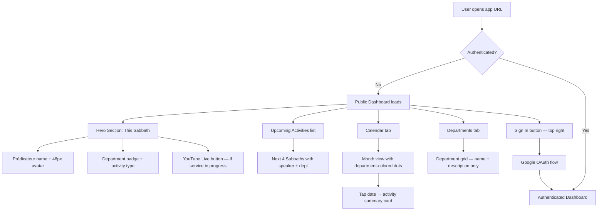
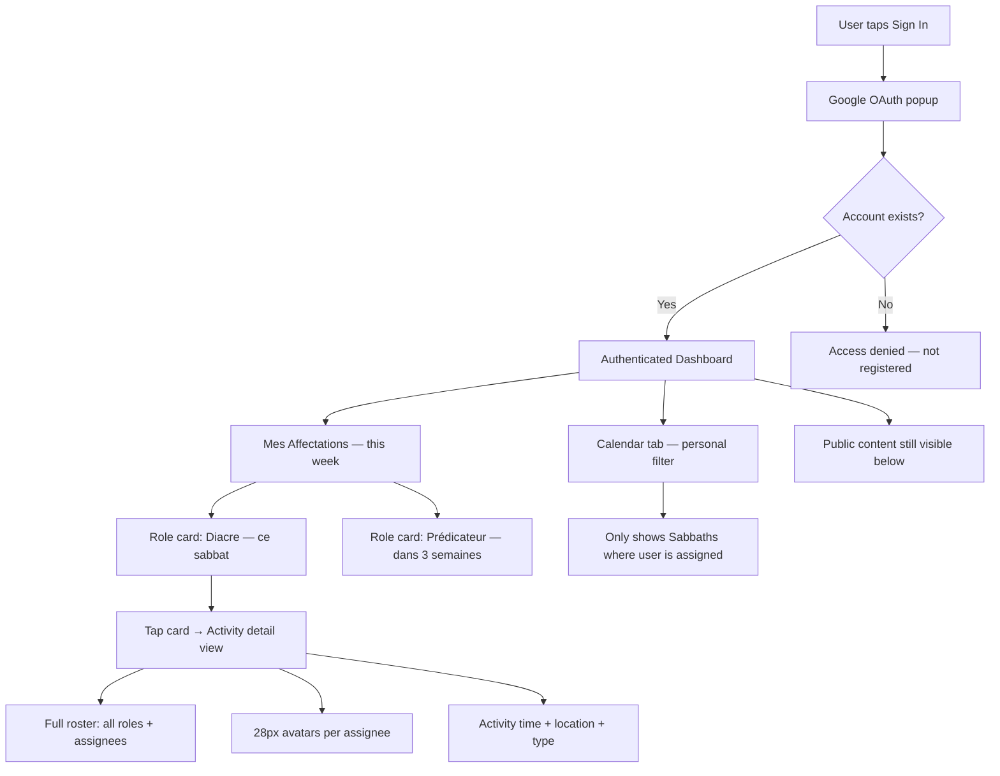
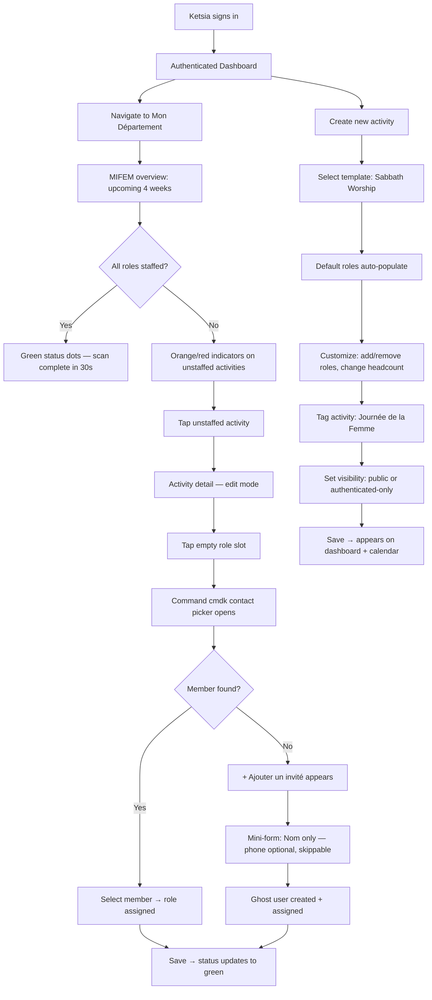
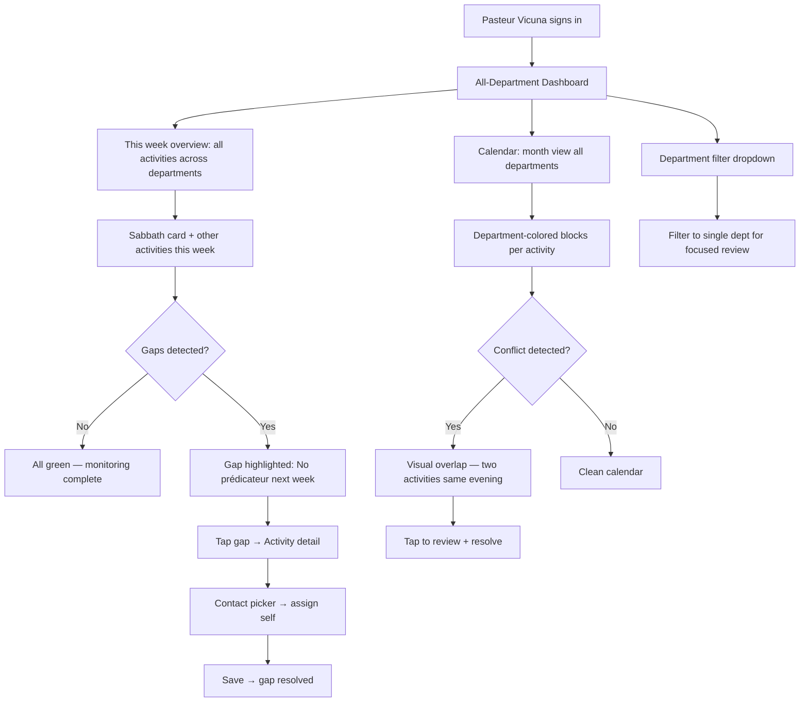
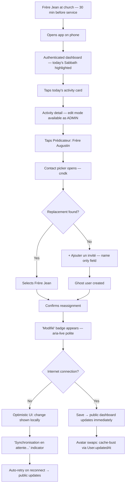

# UX Design Specification sda-management

**Author:** Elisha
**Date:** 2026-02-26

---

## Executive Summary

### Project Vision

SDAC ST-HUBERT Operations Command is a dual-experience web application that transforms private church planning data into a public-facing, role-aware information system. It serves two distinct audiences through a single React SPA: anonymous visitors and congregation members who need instant access to church schedules, live services, and upcoming events — and authenticated church leadership who need operational tools for activity scheduling, department management, and member coordination.

The core UX principle is **information accessibility by role**. Anonymous users see curated public data with zero friction. Officers see personal assignments. Admins manage their scoped departments. The OWNER administers the system. Each role gets exactly the interface they need — no more, no less.

The design language inherits from an existing mock app prototype: indigo-600 accent, slate-900 dark sections, rounded-[2rem+] cards, font-black micro-labels, and an operational-military tone ("Command Center," "Protocol Node," "Registre Personnel"). French-primary UI with English secondary. Mobile-first responsive design with Sunday-first calendar convention.

### Target Users

**Anonymous (Congregation & Visitors):** Non-technical users on mobile phones. Primary interaction is passive consumption — checking this week's schedule, finding the YouTube live link, browsing upcoming events. They visit the app on Friday evenings and Sabbath mornings. Zero patience for login barriers. French-speaking. The app must answer "What's happening at church?" in under 5 seconds.

**Viewer (Officers & Committee Members):** Church volunteers with varying tech comfort. Busy schedules. Primary interaction is self-service lookup — checking personal assignments, viewing full activity rosters, accessing department details. They check the app weekly, often on mobile. They replace phone calls and WhatsApp inquiries with app lookups. Read-only access; they cannot edit anything.

**Admin (Department Directors & Church Leaders):** Moderately technical. Primary interaction splits between monitoring (scanning their department's upcoming activities — a 30-second task most weeks) and occasional creation/editing (setting up new activities with templates, assigning roles, scheduling meetings). The pastor is an Admin assigned to all departments — needs cross-department visibility. Must be fully functional on mobile for last-minute changes at church. Critical path: if admins don't enter data, the public page is empty.

**Owner (System Administrator):** Technical user (developer). Handles first-time setup, infrastructure, user management, and system health. Desktop-primary. Infrequent interactions after initial setup — periodic user management during nominating committee term transitions.

### Key Design Challenges

1. **Admin data entry as critical path.** The entire system's value depends on 3-5 admins consistently entering activity data. Activity creation must minimize friction: template selection auto-populates default roles, admins customize rather than build from scratch. Forms must work flawlessly on mobile — Frere Jean editing assignments 30 minutes before service on his phone is a real scenario.

2. **First-time guided experience (empty states).** The app launches to an empty database. The OWNER's very first impression is blank cards and missing data — the worst possible introduction. Smart empty states must guide sequential setup (church settings → departments → templates → users → first activity) while communicating progress and next steps. The emotional journey of setup determines whether the OWNER feels empowered or overwhelmed.

3. **Role assignment UX on mobile.** The flexible activity model means assigning multiple people to variable roles with configurable headcounts. Assigning 3 people to "Diacres" on a 375px-wide phone screen is the hardest unsolved interaction pattern in this app. Solution direction: chip-based multi-select with search-as-you-type (Gmail "To" field pattern) — a proven mobile-friendly pattern adapted for role context.

4. **Dual-layout architecture and sign-in transition.** Two fundamentally different navigation paradigms — simplified top nav for anonymous public, full 288px sidebar for authenticated. The transition must feel like the app is *expanding to reveal more*, not swapping to a different application. Design direction: unified shell component where the sidebar animates from `width: 0` to `288px` and the top nav morphs into the header breadcrumb. This preserves component tree stability and enables smooth CSS transitions.

5. **Progressive information disclosure.** The same church data renders at four different detail levels by role. Public shows "Pasteur Vicuna preaches." Officers see personal assignments. Admins see the full roster with editing controls. The design must handle this gracefully through progressive layering, not show/hide toggling.

6. **Mobile-first with desktop depth.** The congregation views the app almost exclusively on phones. Admins need mobile editing capability but also use desktop for heavy management. Mobile is the primary experience; desktop expands it. Offline tolerance: graceful "you're offline" state for weak cell signal at church — no silent failures.

### Design Opportunities

1. **The "Friday evening check" hero moment.** The public dashboard — open, instantly see this week's program, YouTube live link, upcoming events — is the app's signature experience. If this screen feels fast, beautiful, and informative in 5 seconds, the app earns trust and daily usage. The mock's dark hero section provides strong visual DNA.

2. **Template-driven activity creation.** Smart defaults mean admins "confirm and adjust" rather than "build from scratch." Template selection → auto-populated roles → customize headcounts → assign people. This is the key lever for admin adoption.

3. **Admin feedback loop.** When an admin saves an activity, a "Published" toast confirms it's live on the public dashboard with a link to view the public perspective. Real-time SignalR isn't just for end users — it's confirmation for admins that their work is live. This closes the trust loop.

4. **Distinctive operational aesthetic.** The mock's military-operational tone creates unique identity. Heavy typography, uppercase micro-labels, indigo glow effects, rounded cards. This aesthetic should carry through consistently — it makes the app feel purposeful and premium.

5. **Unified shell architecture.** Public and authenticated layouts as two states of one component enables smooth animated transitions, preserves React component tree stability, and reinforces the "expanding to reveal more" metaphor. The sign-in moment becomes a design feature, not a disruptive layout swap.

## Core User Experience

### Defining Experience

SDAC ST-HUBERT Operations Command has two defining experiences, one for each side of the dual-experience architecture:

**Primary defining experience (highest volume): "Open and know."** An anonymous user opens the app and within 5 seconds knows what's happening at church — who's preaching, what's the activity, when's the next event, where's the live stream. No login, no navigation, no scrolling past a fold. This is the experience that serves the most people (entire congregation + visitors) and happens most frequently (Friday evenings, Sabbath mornings, throughout the week). If this moment feels instant and complete, the app earns its place on people's home screens.

**Critical defining experience (highest value): "Confirm and adjust."** An admin selects an activity template, reviews the auto-populated roles, adjusts headcounts or swaps assignees, and publishes. The interaction model is *confirmation with exceptions*, not *construction from scratch*. Most weeks, the defaults are right and the admin taps through in under 2 minutes. This is lower volume (3-5 admins, weekly) but the entire system's value depends on it — if this flow is slow or frustrating, admins stop entering data and the public page goes empty.

The relationship between these two experiences is causal: admin entry enables public consumption. The admin experience is the prerequisite; the public experience is the payoff.

### Platform Strategy

**Platform:** Responsive web SPA (React + TypeScript + Tailwind CSS). No native mobile app — the web app must perform like one.

**Primary design target:** Mobile phone (375px–428px). This is where Marie-Claire checks the schedule, where Elisha views his assignments, and where Frere Jean edits roles 30 minutes before service. Every screen is designed phone-first; desktop adapts upward by expanding grid columns and revealing additional context panels.

**Input modality:** Touch-first on mobile (tap targets ≥ 44px, swipe gestures where natural). Mouse/keyboard on desktop (hover states, keyboard shortcuts for power admin actions).

**Responsive strategy:**
- **Mobile (< 768px):** Single-column stacked layouts. Public view: full-width top nav. Authenticated view: hamburger menu → slide-out nav drawer. All admin forms functional at this width.
- **Tablet (768px–1024px):** Two-column grids where appropriate. Sidebar may be collapsible.
- **Desktop (> 1024px):** Full sidebar (288px) + content area. Multi-column grids (up to 4 columns). Calendar views expand to show more detail. Admin forms may use side-by-side panels.

**Offline tolerance:** No offline-first capability for MVP. Graceful degradation: when network is unavailable, show a non-intrusive "You're offline — data may not be current" banner. No silent failures, no broken layouts. The app should feel honest about its state.

**Key device capability:** The app leverages the browser's native share API on mobile for sharing the public dashboard link (e.g., via WhatsApp — the congregation's primary communication channel).

### Effortless Retrieval

These retrieval interactions must require zero cognitive effort — the user just reads:

1. **Finding this week's program (Anonymous).** Open the app → it's right there. No navigation, no taps. The public dashboard's hero section shows the next upcoming activity with predicateur, department, activity type, and time. Below: YouTube live link, upcoming events. The information hierarchy does the work — the user just reads.

2. **Checking personal assignments (Viewer).** Sign in with Google (one tap) → "My Assignments" is immediately visible on the authenticated dashboard. Next duty date, role, and who else is serving. No digging through calendars or department pages. The dashboard knows who you are and shows what matters to you.

3. **Scanning department status (Admin).** Navigate to department → upcoming activities with role staffing indicators (green = fully staffed, amber = gaps). Most weeks, this 30-second scan is the entire admin interaction. No action needed unless something is flagged.

### Low-Friction Input

These input interactions inherently require judgment — the design goal is minimum friction for decision-making, not zero thought:

4. **Creating a standard activity (Admin).** Select template → defaults populate → assign people via chip-based search → save. The template does 80% of the work. Template selection and default population are effortless; role assignment requires searching and selecting from the officer pool — efficient but not effortless. The UX goal is to minimize friction around the judgment calls (who to assign), not eliminate the judgment itself.

5. **Sign-in itself.** Google OAuth = one tap on a familiar button. No forms, no passwords for the majority of users. The app recognizes your email and loads your role-appropriate view instantly.

6. **Last-minute edits (Admin on mobile).** Tap the activity → tap the role → search and select the replacement → save. Three taps and a search. The "Published" toast confirms it's live. Done before the congregation arrives.

### Critical Success Moments

These recurring moments prove the product's value week after week — if any fail, trust erodes:

1. **"I didn't have to ask anyone."** The first time Marie-Claire checks the app on Friday evening and knows exactly what's happening tomorrow without texting anyone on WhatsApp. This is the moment the app replaces the old way. If the information is there and correct, she'll come back every week. If it's missing or wrong, she'll revert to WhatsApp permanently.

2. **"My name is right there."** The first time Elisha signs in and sees his upcoming deacon duty with the date, the roster, and who's serving alongside him. The cognitive load of "am I supposed to be somewhere?" disappears. This moment converts a skeptical officer into a regular user.

3. **"That was fast."** The first time Soeur Ketsia creates next week's MIFEM activity using a template — selects "Sabbath Worship," sees the roles pre-filled, adjusts for Women's Day special, assigns her team, publishes. Under 2 minutes. She expected a tedious form; she got a fast, smart tool. This moment determines whether admins adopt or abandon.

4. **"Everything is already set up."** The first time Pasteur Vicuna opens the dashboard Monday morning and sees the full week across all departments — Sabbath program staffed, midweek prayer group scheduled, board meeting confirmed — without having made a single phone call. The "big picture" is just there. This is when the pastor becomes the app's champion.

5. **"It just updated."** The first time Frere Jean edits the predicateur role at church on his phone and the congregation member checking the public dashboard sees the change instantly. Real-time trust. The app is alive, not a static page.

### Critical First Impression

This one-time moment determines whether setup succeeds or stalls:

6. **"I knew exactly what to do next."** The first time Elisha (OWNER) opens the freshly deployed app and the empty state guides him through setup — church settings first, then departments, then templates, then users, then first activity. No manual needed. Each empty section says "do this next." Setup complete in one evening. Unlike the recurring success moments above, this happens once — but it gates everything that follows.

### Experience Principles

These five principles guide every UX decision in the application:

1. **Information finds you.** Don't make users hunt. The dashboard shows what matters based on who you are — public info for anonymous, personal assignments for officers, department overview for admins. The right data at the right depth for the right person, without navigation.

2. **Confirm, don't construct.** Minimize creative burden on admins. Templates, smart defaults, and pre-populated forms mean the typical interaction is reviewing and adjusting, not building from zero. The system does the heavy lifting; the admin makes the decisions.

3. **Mobile is the real app.** Phone screens are not a degraded desktop experience — they are the primary design target. Every interaction, including admin editing, must be first-class on a 375px screen. Desktop adds space and convenience, but mobile is where the product lives.

4. **Welcome, then expand.** The app greets anonymous visitors warmly as community members — church name, welcome message, this week's program, an inviting tone. Sign-in expands the experience into operational depth with the sharp, military-operational aesthetic. The public layer is warm and inviting; the authenticated layer is efficient and precise. Same design system, different emotional register. Ungated access AND emotional belonging in one principle.

5. **Honest and alive.** The app reflects current reality — real-time updates, honest offline states, immediate feedback on admin actions. If data is stale, say so. If an edit is published, confirm it. If the network is down, show it. No silent failures, no stale caches presented as truth.

## Desired Emotional Response

### Primary Emotional Goals

Each role has a distinct primary emotional target that the UX must deliver:

**Anonymous → Belonging + Informed.** "My church has this. I know what's happening. I feel connected even from far away." The public layer should make Marie-Claire feel like the church is speaking directly to her — warm, present, and accessible. Her daughter in Montreal and cousins in Haiti should feel the same closeness. The app is a digital extension of the church community, not a cold information kiosk.

**Viewer → Relief + Confidence.** "I don't have to ask anyone. I know exactly what I'm doing this Sabbath." Elisha should feel the cognitive burden of scheduling uncertainty lift the moment he sees his assignments. No ambiguity, no second-guessing. The app replaces anxiety ("did I forget something?") with quiet confidence ("I'm prepared"). When a Viewer spots an error they can't fix, the emotion is *helpful messenger*, not impotence — the app shows who to contact by name, transforming "I can't do this" into "I know exactly who can."

**Admin → Competence + Control (active) / Serenity (monitoring).** Two emotional registers for two interaction modes. When creating or editing activities: "I set up next week in 2 minutes. Everything is organized." The tool amplifies effectiveness — a well-organized cockpit with clear indicators and decisive actions. When scanning the department dashboard and everything is green: serenity. "Nothing needs my attention. I can exhale." The staffing indicators are emotional regulators — green means relax, amber means purposeful action. The emotional shift from "all clear" to "action needed" is a smooth gradient, not a jarring alert.

**Owner → Empowerment + Pride.** "I built this for my church. It works. People are using it." The setup experience should feel like assembling something meaningful. Seeing the public dashboard populated with real data for the first time is a launch moment.

### Emotional Journey Mapping

**Discovery (First Visit):**
- **Anonymous:** Warmth and recognition. "Bienvenue" — the church's name, a welcoming message, this week's program. The app feels like it belongs to *this* church, not a generic template. Emotion: *I'm in the right place.*
- **Viewer (first sign-in):** Surprise and delight. Google sign-in takes one tap, and immediately the dashboard shows personal assignments by name. Emotion: *It already knows me.*
- **Admin (first login):** Clarity and direction. The admin interface is organized, the navigation is self-explanatory, department scope is clear. Emotion: *I can do this.*
- **Owner (first deploy):** Guided momentum. Empty states don't feel empty — they feel like a checklist with clear next steps. Emotion: *I know exactly what to do.*

**Core Action:**
- **Anonymous:** Serene consumption. Reading, not interacting. Calm information hierarchy, no demands. Emotion: *Everything I need is right here.*
- **Viewer:** Quick satisfaction. Open → check → done. No friction, no dead ends. Emotion: *That took 10 seconds.*
- **Admin (creating):** Productive flow. Template → adjust → assign → publish. Rhythm and momentum. Emotion: *This is efficient.*
- **Admin (monitoring):** Quiet serenity. Scan → all green → close. The department dashboard feels calm when everything is staffed — minimal visual noise, subtle green indicators. Emotion: *Everything is in order.*
- **Owner:** Architectural satisfaction. Configure → create → organize. Building something that works. Emotion: *The system makes sense.*

**After Task Completion:**
- **All roles:** Nothing left undone. No lingering "did I forget something?" The app confirms actions ("Published"), shows completeness (green staffing indicators), and doesn't nag. Emotion: *Done. I can move on.*

**When Something Goes Wrong:**
- **Network failure:** Honesty, not silence. "You're offline" banner — clear, non-alarming, informative. Emotion: *The app told me. I'm not confused.*
- **Missing data:** Guidance, not blame. Empty states explain what's needed and who can fill it. Emotion: *I understand what's missing and why.*
- **Permission denied:** Respect and agency. "Vous avez remarqué une erreur? Contactez [Soeur Ketsia] pour ajuster." Named contact, constructive path forward. Emotion: *I know exactly who can help.*
- **Data changed after viewing:** Proactive honesty. A "Modifié" badge appears on the public dashboard when activity details change within 24 hours of the event. Tap to see what changed: "Predicateur: Pasteur Vicuna → Frere Jean." This prevents the most emotionally damaging failure — Marie-Claire telling her daughter wrong information based on stale data. The app earns trustworthiness by acknowledging change proactively, not just being transparent in the moment. Emotion: *The app respects that I'm relying on it.*

**Returning (Repeat Visits):**
- **Anonymous:** Ritual. Friday evening check becomes habit. The app is a bookmark, a reflex. Emotion: *This is how I prepare for Sabbath.*
- **Viewer:** Confidence. Weekly check-in, quick scan. Emotion: *Still on top of my responsibilities.*
- **Admin:** Routine mastery. Monday scan, occasional edits. The tool gets faster as familiarity builds. Emotion: *I've got this.*

### Micro-Emotions

**Trust over Skepticism.** Every piece of data must feel current and reliable. Real-time updates, the "Modifié" badge for recent changes, and the "Published" toast all build trust. If the app ever shows stale data without acknowledging it, trust shatters — and the social consequence (telling someone wrong information) makes it personal.

**Confidence over Confusion.** Clear information hierarchy, consistent navigation patterns, and role-appropriate views eliminate "what am I looking at?" Progressive disclosure means each role sees exactly the right amount — no overwhelming admin controls for viewers, no missing context for admins.

**Accomplishment over Frustration.** Admin actions complete cleanly with confirmation. Template-driven creation means admins rarely encounter blank forms. Error states guide toward resolution, not dead ends.

**Belonging over Isolation.** Team names alongside personal assignments. Avatars next to roles. The church's name and welcome message on the public page. Real department abbreviations the congregation knows (JA, MIFEM, MF). The app reinforces "you're part of this community" at every touchpoint.

**Serenity over Anxiety.** The admin monitoring experience should produce calm when things are in order. Green staffing indicators are small and subtle — visual quiet. Amber indicators gently demand attention without alarming. The emotional temperature of the department dashboard shifts smoothly with operational status.

**Agency over Impotence.** When users hit boundaries (Viewer can't edit, Anonymous can't see internal data), the response provides a constructive path — named contacts, clear explanations, respectful redirection. No dead ends, no cold "Access Denied."

### Design Implications

| Emotional Goal | UX Design Approach |
|---|---|
| **Belonging** | Church name and warm welcome message on public dashboard. Team/roster context alongside personal assignments. Avatars beside role assignments. French-primary with familiar church terminology. Real department abbreviations (JA, MIFEM, MF). |
| **Relief** | "My Assignments" as first thing viewers see post-login. Next duty highlighted with date and roster context. Full team visible so officers know who's serving alongside them. |
| **Competence** | Template-driven activity creation. Department dashboard with staffing indicators. "Published" toast with public preview link. Operational aesthetic — cockpit, not a form. |
| **Serenity** | Quiet department dashboard when fully staffed — subtle green, minimal noise. Smooth emotional gradient from "all clear" to "action needed." No alarming alerts for routine gaps. |
| **Trust** | Real-time SignalR updates. "Modifié" badge for recent activity changes. Honest offline banner. Immediate reflection of edits. Timestamps where ambiguity might arise. |
| **Agency** | Named admin contact in Viewer escalation paths. Constructive permission-denied messages. Error states with clear "what to do next" guidance. |
| **Calm** | Role-appropriate information density. Whitespace and rounded-card design language create breathing room. Animations respect `prefers-reduced-motion`. No feature overload per role. |

### Emotional Design Principles

1. **Warm before operational.** The first emotion any user feels should be welcome, not utility. The public layer leads with the church's identity — name, message, community context — before presenting schedule data. The authenticated layer leads with "Hello [Name], here's what's coming up" before presenting operational controls.

2. **Confirm every action.** No silent state changes. When an admin publishes, toast it. When a viewer signs in, greet them by name. When the network drops, say so. Every user action gets acknowledgment — this builds the "honest and alive" feeling that sustains trust.

3. **Progressive calm.** Each layer of the experience reveals more detail without increasing anxiety. Public is serene. Viewer adds personal context without complexity. Admin adds controls without clutter. The emotional temperature stays steady even as information density increases — achieved through consistent layout patterns, generous whitespace, and the card-based containment system.

4. **Celebrate readiness, not emptiness.** Empty states are not error states. A fresh department page doesn't say "No activities" — it says "Prêt à planifier. Créez votre première activité." Every empty state communicates possibility and next steps, not absence. The tone is encouraging, not clinical.

5. **Respect over restriction.** When users hit permission boundaries, the response is respectful guidance with named contacts ("Contactez [Soeur Ketsia] pour ajuster"), not a cold "Access Denied." The app acknowledges the user's intent and redirects constructively. No dead ends.

6. **Mirror the community.** The app should feel like it was made *by* Saint-Hubert *for* Saint-Hubert. Real church name, real pastor's name next to assignments, real department abbreviations the congregation already uses, the church's actual YouTube channel. Every piece of real data reinforces ownership. This isn't a generic tool with a name pasted on — it's *their* app.

## UX Pattern Analysis & Inspiration

### Inspiring Products Analysis

**1. The Mock App (st-hubert-operations-command)**

The existing prototype is the primary design reference — it established the visual DNA that carries forward.

- **What it does well:** Bold typographic hierarchy with `font-black` at 900 weight. The micro-label system (`text-[10px] font-black uppercase tracking-widest`) creates a distinctive metadata layer. Card-based layout with generous radius (`rounded-[2rem]` to `rounded-[3rem]`) feels premium and modern. The dark hero section (slate-900) with indigo accents creates visual drama. Hover interactions (lift + border shift + shadow deepening) add tactile feedback.
- **What to carry forward:** The entire visual system — indigo-600 accent, slate-900 dark sections, rounded cards, micro-labels, sidebar layout with role-filtered nav, operational-military tone for the authenticated layer.
- **What to improve:** The mock has no public layer, no empty states, no mobile responsive behavior, no activity creation flow with flexible roles, and no sign-in transition. The mock's military vocabulary ("Sanctuary Operations," "Protocol Node," "Terminate Session") is correct for the authenticated layer but wrong for the public layer — the public side needs warm church vocabulary.

**2. Notion**

Notion's dashboard-first experience and progressive depth model is the closest analogue to the authenticated dashboard.

- **What it does well:** Clean, spacious layouts with generous whitespace. Typography-driven hierarchy. Sidebar navigation with collapsible sections. The "overview → drill into detail" pattern matches admin monitoring. Empty states are inviting — they show what *could* be there and guide creation. Skeleton loading states (grey placeholders matching content layout) prevent layout shift and feel faster than spinners.
- **Transferable patterns:** Dashboard as a living overview. Sidebar with clean section grouping. Empty states as possibilities, not absences. Skeleton loaders for perceived performance. Typography-first hierarchy where visual weight does the work.
- **What to adapt:** Notion is minimalist-neutral; our app has two emotional registers — warm (public) and operational (authenticated). We take Notion's spatial intelligence and dress it in our design system.

**3. Google Calendar**

The standard for schedule visualization. Our calendar views should feel as intuitive.

- **What it does well:** Instantly recognizable calendar grid. Color-coded events by category. Quick event creation by clicking a time slot. Week view as the most useful default for planning. Mobile: swipe between days, pull down for month overview, tap to drill in.
- **Transferable patterns:** Department color coding on events. Week view as admin default. Day view for "what's happening today." Month view for big picture. Mobile swipe gestures. Quick-create from calendar (tap day → creation modal pre-filled with date). Event density visible as colored blocks before reading text.
- **What to adapt:** Our calendar is Sunday-first (day 1) through Saturday (day 7), matching SDA convention. Google Calendar's utilitarian aesthetic gets dressed in our premium design language — rounded containers, indigo accents, dark header row.

**4. YouTube (Mobile)**

The congregation's live stream destination. The public dashboard's YouTube embed should feel native.

- **What it does well:** Live badge and viewer count are instantly recognizable. Red "LIVE" indicator is universal. Autoplay and instant-load create immediacy.
- **Transferable patterns:** Live status indicator — pulsing dot with "EN DIRECT" text. Video embed at 16:9 aspect ratio with gradient overlay for text legibility. Frictionless "tap to watch" affordance.
- **What to adapt:** YouTube's red live accent maps to rose/red-500 in our system, while indigo-600 remains the primary accent.

**5. Gmail (Compose / To Field)**

The chip-based multi-select pattern for role assignment.

- **What it does well:** Type a few characters → suggestions appear → tap to add as a chip. Chips are compact with clear "x" to remove. The field grows vertically as chips are added. Search is instant and forgiving.
- **Transferable patterns:** Chip-based multi-select for assigning people to roles. Search-as-you-type with fuzzy matching. Compact chip display on 375px screens. Vertical growth of input area.
- **What to adapt:** For our ~30 person officer pool, pure search is overkill. Use a **department-grouped contact picker**: show all officers grouped by department as the default view, with a search bar at top that filters in real-time. On mobile, this is a full-screen bottom sheet with scrollable department sections. On desktop, a dropdown panel. When the admin knows the name, they type and filter. When browsing ("who's available in Diaconat?"), they scroll the department group. Chips use our design system — rounded-xl, small avatar thumbnail, person's name, indigo accent on selection.

### Vocabulary Register

The public and authenticated layers share the same data but speak different languages. The public layer uses warm church bulletin vocabulary; the authenticated layer uses the operational-military tone from the mock.

| Element | Public Layer (Warm) | Authenticated Layer (Operational) |
|---|---|---|
| Main page title | "Accueil" | "Command Center" |
| Current activity | "Ce Sabbat" | "Programme en cours" |
| People references | "Pasteur Vicuna prêche" | "Predicateur: Vicuna, L." |
| YouTube section | "Suivez le culte en direct" | "Signal Diffusion: En ligne" |
| Sign in button | "Connexion" | — |
| Departments listing | "Nos Départements" | "Unités Ministérielles" |
| Upcoming events | "Activités à venir" | "Pipeline Opérationnel" |
| Calendar | "Calendrier" | "Ministry Roadmap" |
| Logout | — | "Terminate Session" |
| Navigation breadcrumb | — | "Protocol Node → [section]" |

This vocabulary mapping ensures consistent copy across the application. The public side speaks like a welcoming church bulletin. The authenticated side speaks like a command center.

### Transferable UX Patterns

**Navigation Patterns:**

| Pattern | Source | Application |
|---|---|---|
| Sidebar with role-filtered sections | Mock App + Notion | Authenticated navigation — shows only items relevant to user's role. Collapses to hamburger on mobile. |
| Top nav bar (simplified) | Modern SPA convention | Public layer — church name, nav links (Accueil, Calendrier, Départements, En Direct), "Connexion" button. |
| Bottom sheet for mobile actions | Google Calendar mobile | Activity creation on mobile — slide-up panel instead of centered modal. Note: multi-step form content must scroll independently of the sheet dismiss gesture. |
| Breadcrumb + context header | Mock App | "Protocol Node → dashboard" pattern for orientation within authenticated view. |

**Interaction Patterns:**

| Pattern | Source | Application |
|---|---|---|
| Department-grouped contact picker | Gmail + custom | Assigning people to roles. Default: all officers grouped by department. Top: search bar for type-to-filter. Mobile: full-screen bottom sheet. Desktop: dropdown panel. Chips for selected people. |
| Quick-create from calendar | Google Calendar | Admin taps a day → activity creation pre-filled with date. |
| Card hover → lift + shadow | Mock App | Desktop feedback. Cards lift on hover with shadow deepening. Disabled on touch. |
| Swipe between views | Google Calendar mobile | Calendar day view — swipe left/right to navigate days. |
| Template selection cards | Notion template gallery | Activity creation step 1 — visual cards for templates (Sabbath Worship, Sainte-Cene, Meeting) with descriptions. Tap to select. |
| Toast notifications | Modern convention | "Publié" confirmation after admin saves. Non-blocking, auto-dismiss, with "Voir" action link. |

**Visual & Performance Patterns:**

| Pattern | Source | Application |
|---|---|---|
| Typography-first hierarchy | Notion + Mock App | `font-black` headings, slate-400 secondary, indigo-500 accent. Weight and color do the hierarchy work. |
| Department color coding | Google Calendar | Consistent hex per department. On calendar events, cards, and assignment chips. |
| Dark hero section | Mock App | Public dashboard hero — slate-900 with next activity, YouTube embed, key info. |
| Rounded card containment | Mock App | `rounded-[2rem]` to `rounded-[3rem]` cards. White on slate-50. Border-slate-100. |
| Status indicators (color dots) | Notion + Google Calendar | Green = staffed. Amber = gaps. Red/rose = live. Pulsing for live. Small, emotionally calibrated. |
| Skeleton loading states | Notion | Grey placeholder shapes matching content layout during API loads. Prevents layout shift, feels faster than spinners. |
| Identity-first loading | Airbnb pattern | On public layer, church name and nav shell render immediately before any API call returns. User knows they're in the right place before data arrives. Data loads second, identity loads first. |

### Anti-Patterns to Avoid

1. **Generic church software aesthetic.** Beige backgrounds, clip-art icons, dated typography. The mock established a premium, modern identity — protect it.

2. **Login wall before value.** The public layer provides full value without any barrier. The sign-in button is an invitation, not a gate.

3. **Feature-packed navigation.** Role-filtered sidebar: VIEWERs see 4 items, ADMINs see 6, OWNERs see system health. Never expose features a role can't use.

4. **Desktop-first responsive design.** Design phone-first (375px), expand upward. Admin forms designed *for* mobile, not squeezed into it.

5. **Centered modals for complex forms on mobile.** Activity creation with template selection and role assignment is too complex for a centered modal on mobile. Use a full-screen slide-up bottom sheet on mobile, a large side panel or modal on desktop. Note: bottom sheet content must scroll independently of sheet dismiss gesture — spec this for the developer.

6. **Silent state changes.** Every state change gets acknowledgment. "Publié" toast, "Modifié" badge, offline banner.

7. **Dead-end permission errors.** Every boundary includes named contact and constructive path forward.

8. **Monday-first calendar.** SDA convention: Sunday = day 1, Saturday = day 7. This is the default, not a buried setting.

9. **Military vocabulary on public layer.** "Command Center" and "Protocol Node" are for authenticated users. The public layer speaks warm church language: "Ce Sabbat," "Nos Départements," "Activités à venir."

### Design Inspiration Strategy

**Adopt Directly:**
- Mock App's entire authenticated visual system (indigo-600, slate-900, rounded cards, font-black micro-labels, operational tone)
- Gmail's chip-based multi-select (adapted as department-grouped contact picker)
- Google Calendar's department color coding on events
- Notion's empty state philosophy (possibilities, not absences)
- Notion's skeleton loading states for perceived performance
- Toast notifications for admin action confirmation

**Adapt to Our Context:**
- Notion's dashboard-first pattern → role-aware dashboard (different content per role, same spatial logic)
- Google Calendar's week view → Sunday-first calendar with SDA event types and department filters
- Notion's sidebar → role-filtered sidebar with mock's visual styling
- Google Calendar mobile's gestures → mobile calendar with swipe navigation
- Bottom sheet pattern → mobile activity creation (full-screen slide-up with template selection, with specified scroll behavior)
- Identity-first loading → church name and shell render before API data on public layer

**Avoid:**
- Generic church aesthetics — protect the premium identity
- Login walls — public layer is ungated and warm
- Desktop-first design — mobile is the primary target
- Centered modals for complex mobile forms — use full-screen panels
- Monday-first calendar — SDA Sunday-first convention
- Silent state changes — confirm every action
- Military vocabulary on public-facing pages — warm church language only

## Design System Foundation

### Design System Choice

**shadcn/ui + Radix UI primitives + Tailwind CSS** — a themeable, copy-paste component system built on accessible primitives and utility-first styling.

All dependencies are MIT-licensed and free. No commercial licenses required.

- **shadcn/ui** (MIT): Copy-paste React components that live in your codebase. Not an npm dependency — you own the source. Built on Radix UI primitives and styled with Tailwind CSS.
- **Radix UI** (MIT): Unstyled, accessible UI primitives. Handles complex interaction patterns (dialogs, dropdowns, popovers, toasts, tooltips, accordions) with full WCAG compliance. The accessibility layer you don't have to build.
- **Tailwind CSS** (MIT): Utility-first CSS framework already in the tech stack. Design tokens (colors, spacing, typography, border radius) defined in `tailwind.config.ts` and applied consistently across all components.

### Rationale for Selection

1. **Tech stack alignment.** Tailwind CSS is already the chosen styling framework. shadcn/ui is built natively on Tailwind — zero friction, no CSS-in-JS conflicts, no parallel styling systems.

2. **Solo developer velocity.** Copy-paste architecture means Elisha takes only the components needed, customizes them in-place, and skips the rest. No framework lock-in, no fighting opinionated defaults, no dependency upgrade anxiety.

3. **Visual identity preservation.** The mock app established a distinctive design language (indigo-600, slate-900, rounded-[2rem+], font-black micro-labels). shadcn/ui components are fully customizable via Tailwind classes — the mock's visual DNA applies directly. MUI or Ant Design would fight this identity; shadcn/ui embraces it.

4. **Dual-register support.** The same component (e.g., a card, a navigation item, a heading) renders with warm public styling or operational authenticated styling. A theme register context delivers the active mode (`"public"` | `"operational"`) to the component tree; individual components apply the correct styling variant. Two CSS custom property value sets (`--primary`, `--background`, `--accent`, etc.) toggled by a class on `<html>` enable Tailwind's token system to work natively across both registers.

5. **Accessibility for free.** Radix primitives provide keyboard navigation, screen reader support, focus management, and ARIA attributes out of the box. Critical for a church app serving users of all abilities — and achieved without dedicated accessibility engineering.

6. **Zero licensing cost.** All three libraries are MIT-licensed. No commercial licenses, no per-seat fees, no usage restrictions. Fully open source.

7. **Direct testability.** Components living in the project codebase (not wrapped behind a library's internal implementation) are directly testable with standard React testing tools. No fighting library internals — the component file *is* the source of truth.

### Implementation Approach

**Component adoption strategy: Pull what you need, edit in-place.**

- Start with shadcn/ui's CLI (`npx shadcn-ui@latest add [component]`) to scaffold components into `src/components/ui/`
- Each component is a local file — **edit in-place** with project design tokens. No wrapper components, no indirection layer. For a solo developer, the scaffolded file *is* the final component.
- Prioritized component list for MVP:
  - **Layout:** Card, Separator, Sheet (bottom sheet on mobile), ScrollArea
  - **Navigation:** NavigationMenu, Sidebar, Breadcrumb, Tabs
  - **Forms:** Button, Input, Select, Checkbox, Label, Form (react-hook-form integration)
  - **Data display:** Table, Badge, Avatar, Calendar
  - **Feedback:** Toast (Sonner), Dialog, AlertDialog, Tooltip
  - **Role assignment — Command (cmdk):** Core primitive for the department-grouped contact picker. Powers search-as-you-type, section grouping by department, and keyboard navigation across the ~30 person officer pool. Used inside a Popover on desktop and a full-screen Sheet on mobile. **This component requires a dedicated component specification** — it combines search, multi-select, department grouping, two surface patterns, chip rendering, and complex keyboard navigation. A line item is insufficient; the architecture spec must detail interaction states, empty results handling, and mobile/desktop behavior differences.

**Design token foundation in `tailwind.config.ts`:**

- Colors: `indigo-600` (primary accent), `slate-900` (dark sections), `slate-50` (light backgrounds), `rose-500` (live indicator)
- Department colors: **Muted background tints that never compete with the primary indigo accent.** Department hex values are desaturated hues used as card backgrounds and calendar event fills — think Google Calendar's event color palette. They coexist without overpowering. Constrain to 6–8 distinct muted hues across the 12 departments (group similar departments under shared hues). Exact hex values defined in the architecture specification / design tokens file.
- Border radius: `2rem` default for cards, `xl` for chips and badges, `full` for avatars
- Typography: `font-black` (900) for headings, `font-bold` (700) for sub-headings, `text-[10px] font-black uppercase tracking-widest` for micro-labels
- Shadows: Layered elevation system for card hover states

### Customization Strategy

**1. Theming layer.** Override shadcn/ui's default CSS variables with the project's design tokens. Two complete color palettes (public and operational) defined as CSS custom property sets, toggled by a class on `<html>`. `tailwind.config.ts` extends with custom values (rounded-[2rem], micro-label utility classes, operational typography scale).

**2. Dual-register components.** Components consume a theme register context and apply the corresponding styling variant. Example: `<Card>` in the public register renders with softer radius and warmer colors; in the operational register, it renders with the mock's sharp, indigo-accented style. The class-variance-authority (`cva`) pattern already built into shadcn/ui's architecture handles variant switching — no additional tooling needed.

**3. Custom components built on Radix primitives.** Components not covered by shadcn/ui defaults — the department-grouped contact picker, the staffing indicator dots, the "Modifié" change badge, the live stream embed — are built as custom components using Radix primitives for accessibility and Tailwind for styling. They follow the same file structure and pattern as shadcn/ui components in `src/components/ui/` for consistency.

**4. Mobile-first responsive tokens.** All component variants are designed at 375px first. Responsive breakpoints (`md:`, `lg:`) expand layouts — never the other way. The Sheet component (bottom sheet) is the primary mobile surface for complex interactions; Dialog (centered modal) is desktop-only for those same flows.

> **Technical Implementation Notes (for Architecture Specification):**
> The following implementation details are UX-informed decisions that should be fully specified in the architecture document:
> - `<ThemeRegisterProvider>` React context pattern for delivering the active register to the component tree
> - CSS custom property dual-set structure in `globals.css` (`.register-public` vs `.register-operational` on `<html>`)
> - Sign-in transition timing: register context must update *before* shell animation begins (`width: 0` → `288px`) to prevent layout flash where warm-styled components briefly appear in the authenticated layout
> - Department-grouped contact picker (Command + Popover/Sheet): full component specification including interaction states, keyboard navigation within groups, empty search results, chip rendering logic, and mobile/desktop surface differences

## Defining Core Experience

### The Defining Interaction

**The pitch:** *"See your church's week instantly — or sign in and organize it in 2 minutes."*

SDAC ST-HUBERT Operations Command has two defining interactions that form one causal chain:

- **"Open and know"** (Anonymous/Viewer) — the highest-volume experience that serves the entire congregation
- **"Confirm and adjust"** (Admin) — the highest-value experience that makes "open and know" possible

The admin experience is the prerequisite; the public experience is the payoff. If admins don't enter data, the public dashboard is empty. If the public dashboard is empty, the app has no value.

### User Mental Model

**Congregation (Anonymous/Viewer):** The current mental model is **"I ask a person, a person answers."** Marie-Claire texts someone on WhatsApp to ask who's preaching. Elisha calls to confirm his deacon duty. The app replaces the person with an always-available, always-current source — but it must feel just as personal and trustworthy as asking a friend.

**Trust transfer:** When Marie-Claire texts a friend and gets an answer, she trusts it because it came from a *person* she knows. When the app shows information, trust comes from *freshness and correctness*. The app must earn the trust that personal relationships currently hold. This is why the "Modifié" badge, real-time SignalR updates, and "Publié" toast are not optional polish — they are **trust transfer mechanisms** that replace the social proof of "my friend told me." Without them, the app is less trustworthy than WhatsApp, and users revert. Every freshness signal in the UI exists to bridge this trust gap.

**Admins:** The current mental model is the **Excel spreadsheet** ("PLANNING GENERAL FINAL POUR COMITE.xlsx"). Soeur Ketsia opens the spreadsheet, fills in next Saturday's row, and shares it. The app must feel *faster and easier* than the spreadsheet — not more complex. The template-driven "confirm and adjust" pattern directly maps to the spreadsheet mental model: the row already has defaults, you just edit the cells that change. If the app ever feels slower or more cumbersome than Excel, admins revert.

### Success Criteria

| Criterion | Target | Measurement |
|---|---|---|
| Time to information (Anonymous) | < 5 seconds from app open | Hero section loads with current program before any scroll |
| Time to personal context (Viewer) | < 10 seconds from sign-in tap | Google OAuth + dashboard render with "My Assignments" |
| Time to publish activity (Admin) | < 2 minutes for a standard week | Template select → adjust → assign → publish |
| Data freshness trust | Real-time | SignalR updates, "Modifié" badge, "Publié" toast |
| First-time setup completion (Owner) | One evening session | Guided empty states, sequential setup flow |
| Data entry adoption (Admin) | ≥ 90% of Sabbaths within first 3 months | The north star metric — the entire value chain depends on admins consistently entering data. Speed (< 2 minutes) drives consistency. If it takes 10 minutes, admins skip weeks. If it takes 2 minutes, it becomes routine. |

### Novel UX Patterns

This product uses **entirely established patterns combined in a role-aware way** — no novel interaction design needed:

| Pattern | Source | Our Application |
|---|---|---|
| Dashboard-first information display | Notion, Google Home | Role-aware dashboard — different content density per role, same spatial pattern |
| Template-driven creation | Notion templates, Google Calendar quick-create | Activity templates with pre-populated roles — "confirm and adjust" |
| Chip-based multi-select | Gmail To field | Department-grouped contact picker for role assignment |
| Real-time updates | Slack, Google Docs | SignalR push for live program changes |
| Progressive disclosure by role | SaaS products (Jira, Notion) | 4-tier RBAC — each role sees exactly the right depth |

The innovation is not in any single pattern — it's in the **role-aware combination** that serves four distinct audiences through one SPA. The UX challenge is orchestrating established patterns into a seamless dual-register experience.

### Experience Mechanics

#### Experience A: "Open and Know" (Anonymous)

1. **Initiation:** User taps bookmark or types URL. Identity-first loading: church name and nav shell render immediately before API data.
2. **Interaction:** Zero interaction required. The hero section displays this week's program — predicateur, activity type, department, time. Below: YouTube live link (with "EN DIRECT" pulsing indicator when active), upcoming events list. Scroll for calendar and department overview.
3. **Feedback:** Information is *present* — that's the feedback. The "Modifié" badge appears on recently changed activities (trust transfer mechanism). Timestamps provide freshness context.
4. **Completion:** There is no "completion" — the user reads and leaves. The experience is successful when the user closes the app knowing what they needed to know.

#### Experience B: "Check and Confirm" (Viewer)

1. **Initiation:** User taps "Connexion" → Google OAuth (one tap on a familiar button). Dashboard renders with personalized content.
2. **Interaction:** "My Assignments" card is immediately visible — next duty date, role name, and team roster (who's serving alongside). Tap the assignment to see full activity details: complete role list, activity time, department, any notes.
3. **Feedback:** Personalization is the feedback — "Hello [Name]" greeting, assignments shown by name, team members listed. The viewer sees themselves reflected in the system. If an assignment changes, the "Modifié" badge appears on the affected card. If something looks wrong, the card shows a named contact ("Contactez [Soeur Ketsia] pour ajuster") — agency, not impotence.
4. **Completion:** The viewer closes the app knowing their responsibilities. Quick satisfaction: open → check → done. The cognitive load of "am I supposed to be somewhere?" is resolved in 10 seconds. This experience is the conversion funnel — when officers love it, they tell leadership "this thing works," reinforcing admin adoption.

#### Experience C: "Confirm and Adjust" (Admin)

1. **Initiation:** Admin navigates to department or calendar → taps "+" or taps a day in calendar view. Activity creation opens as a full-screen bottom sheet (mobile) or side panel (desktop).
2. **Interaction:**
   - **Step 1 — Template selection:** Visual cards (Sabbath Worship, Sainte-Cène, Meeting, Custom). Tap to select. Defaults populate all roles and headcounts.
   - **Step 2 — Review & adjust:** Pre-filled roles displayed as a scrollable list of inline role sections within the creation sheet. Each role section shows: role name, default headcount (editable), and assigned people (chips). Most weeks, defaults are correct — the admin scans and moves to step 3.
   - **Step 3 — Assign people:** Each role section has an inline "tap to add" affordance. Tapping opens the department-grouped contact picker *in-context* — the admin stays within the creation flow, never leaving the form. Browse by department section or search-as-you-type. Tap to add as chip. The picker closes and the chip appears in the role section. Move to the next role — no open/close churn, no losing your place.
   - **Step 4 — Publish:** Tap "Publier." "Publié" toast confirms with "Voir" link to public view.
3. **Feedback:** Each step provides visual confirmation — selected template highlights, populated fields appear, chips accumulate in role sections, staffing indicators shift from amber to green as roles fill. The creation sheet shows a live completeness state.
4. **Completion:** The "Publié" toast with public preview link. The department dashboard shows green staffing indicators. The activity appears on the public dashboard in real-time via SignalR. Admin closes the app knowing the week is set — under 2 minutes.

## Visual Design Foundation

### Color System

**Primary Palette:**

| Token | Value | Usage |
|---|---|---|
| `--primary` | `indigo-600` (#4F46E5) | Primary accent — buttons, active states, links, selected items, focus rings. Single value across both registers. |
| `--primary-hover` | `indigo-700` (#4338CA) | Hover state for primary elements |
| `--primary-light` | `indigo-50` (#EEF2FF) | Subtle background tints for selected cards, active nav items |
| `--destructive` | `red-600` (#DC2626) | Delete actions, critical errors — used sparingly |
| `--success` | `emerald-600` (#059669) | Staffing complete, published confirmation, system healthy |
| `--warning` | `amber-500` (#F59E0B) | Staffing gaps, attention needed — not alarming, purposeful |
| `--live` | `rose-500` (#F43F5E) | YouTube live indicator — pulsing dot with "EN DIRECT" |

**Neutral Palette:**

| Token | Value | Usage |
|---|---|---|
| `--background` | `white` (#FFFFFF) | Page background, card surfaces |
| `--background-subtle` | `slate-50` (#F8FAFC) | Section backgrounds, alternating rows |
| `--surface-dark` | `slate-900` (#0F172A) | Dark hero section (public dashboard), dark sidebar header (authenticated) |
| `--foreground` | `slate-900` (#0F172A) | Primary text |
| `--foreground-secondary` | `slate-600` (#475569) | Secondary text, metadata, timestamps. 5.7:1 contrast on white — comfortable for older users and bright outdoor screens. |
| `--foreground-muted` | `slate-400` (#94A3B8) | Placeholder text, disabled states only (not for readable content) |
| `--border` | `slate-200` (#E2E8F0) | Card borders, dividers, input outlines |
| `--border-subtle` | `slate-100` (#F1F5F9) | Subtle separators, table row borders |

**Hard rule: Semantic tokens only in components.** All color references in components use semantic tokens (`bg-primary`, `text-foreground`, `border-border`), never raw Tailwind colors (`bg-indigo-600`). Raw color values exist only in `globals.css` variable definitions. This is what makes the register toggle work — changing CSS variables updates every component. A single `bg-indigo-600` hardcoded in a component breaks the register system.

**Dual-Register Color Overrides:**

The registers share the same primary palette (`indigo-600`). The visual shift between public and operational is carried by typography treatment, vocabulary, and information density — not color. The only color-level differences:

| Token | Public Register | Operational Register |
|---|---|---|
| `--surface-hero` | `slate-800` (#1E293B) — softer dark for welcoming feel | `slate-900` (#0F172A) — deep dark for operational gravity |
| `--accent-glow` | none | `indigo-500/10` — subtle glow on hover cards |

**Department Color Palette:**

Muted, desaturated background tints that coexist without competing with the indigo primary. Used on calendar event blocks, department cards, and assignment chips.

| Hue Group | Departments | Tint Value | Usage |
|---|---|---|---|
| Blue-grey | Communication, Secrétariat | `slate-200/60` | Neutral administrative departments |
| Teal | JA (Jeunesse Adventiste) | `teal-200/60` | Youth energy, distinct from indigo primary |
| Violet | MIFEM, MF (Ministère des Femmes) | `violet-200/60` | Women's ministries cluster |
| Amber | ME (Ministère des Enfants) | `amber-200/60` | Children's warmth |
| Emerald | MP (Ministère Personnel) | `emerald-200/60` | Growth and outreach |
| Rose | Musique, Culte | `rose-200/60` | Worship and arts |
| Sky | Diaconat | `sky-200/60` | Service and hospitality |
| Orange | AE (Action d'Entraide) | `orange-200/60` | Community action warmth |

**Shared hues are intentional semantic grouping.** When two departments share a hue (e.g., MIFEM and MF both in violet), this signals *category kinship* (women's ministries cluster) — it is a deliberate design choice, not a limitation. Departments within a shared hue are distinguished by their text labels, which are always present.

**Hard rule: Department colors never appear without an accompanying text label.** On calendars, cards, and chips, the department abbreviation (JA, MIFEM, etc.) or full name must always be visible on or adjacent to the color block. Color is a secondary identifier — text is primary. This ensures accessibility for color-blind users.

**Calendar event block sizing:** Department color blocks on the calendar must be large enough for the color to register as a quick-scan category signal before reading text. The pastor's all-department calendar view relies on color grouping for rapid cross-department scanning — color blocks should fill the event container, not appear as a thin accent line.

**High-contrast fallback:** Department colors should also support rendering as **left-border accents** (4px solid left border at full opacity) as an alternative to background tints, for projected displays or low-contrast environments. Flag for architecture spec.

Exact hex values and opacity tuning finalized in the design tokens file.

**Semantic Status Colors:**

| Status | Color | Size | Context |
|---|---|---|---|
| Fully staffed | `emerald-500` dot (8px) | Small, quiet | Department dashboard — emotional calm |
| Gaps remaining | `amber-500` dot (8px) | Small, purposeful | Department dashboard — action needed |
| Live now | `rose-500` pulsing dot (8px) | Animated | YouTube live indicator |
| Published | `emerald-600` toast accent | Toast bar | Activity publish confirmation |
| Modified | `amber-500` badge | Small pill | "Modifié" badge on recently changed activities |

### Typography System

**Font Stack:**

- **Primary:** `Inter` — clean, modern sans-serif with excellent screen legibility. Wide character set supporting French accented characters (é, è, ê, ë, à, ç, ù, î, ô). Variable font for precise weight control. **Self-hosted as WOFF2 with `font-display: swap`** — no external CDN dependency. The font must be available immediately for identity-first rendering (church name renders before API data).
- **Fallback:** `system-ui, -apple-system, sans-serif`
- **Monospace (code/data):** `JetBrains Mono` or `Fira Code` — for timestamps, system IDs, debug info (Owner view only)

**Type Scale:**

| Level | Size | Weight | Line Height | Usage |
|---|---|---|---|---|
| Display | `text-3xl` (30px) | `font-black` (900) | 1.2 | Public hero headline ("Ce Sabbat"), page titles |
| H1 | `text-2xl` (24px) | `font-black` (900) | 1.25 | Section headings ("Command Center", "Mes Affectations") |
| H2 | `text-xl` (20px) | `font-bold` (700) | 1.3 | Card titles, department names |
| H3 | `text-lg` (18px) | `font-semibold` (600) | 1.4 | Sub-section headings, role names in activity view |
| Body | `text-base` (16px) | `font-normal` (400) | 1.5 | Paragraph text, descriptions |
| Body Small | `text-sm` (14px) | `font-normal` (400) | 1.5 | Secondary information, table cells, metadata |
| Form Label | `text-base` (16px) | `font-medium` (500) | 1.5 | Form field labels in operational register. `font-medium` minimum for scan-ability on mobile forms — never `font-normal` for labels in creation flows. |
| Micro-label | `text-[11px]` | `font-black` (900) | 1.2 | UPPERCASE tracking-widest. Operational metadata labels ("PREDICATEUR", "DÉPARTEMENT", "STATUS"). Bumped from 10px to 11px for better cross-device DPI resilience while maintaining the signature aesthetic. **Operational register only.** |
| Caption | `text-xs` (12px) | `font-medium` (500) | 1.4 | Timestamps, helper text, badge content. **Operational register only.** |

**Hard rule: Public layer minimum text size is 14px (`text-sm`).** The 11px micro-label and 12px caption are exclusive to the authenticated operational register. The public layer never renders text smaller than 14px — ensuring readability for the full congregation, including older members on lower-DPI mobile screens.

**Register-Specific Typography:**

| Element | Public Register | Operational Register |
|---|---|---|
| Section headings | Sentence case, `font-bold` ("Activités à venir") | UPPERCASE micro-label system where appropriate ("PIPELINE OPÉRATIONNEL") |
| Person references | Full natural name ("Pasteur Vicuna prêche") | Abbreviated format ("Predicateur: Vicuna, L.") |
| Metadata labels | Hidden or minimal — information speaks for itself | Visible micro-labels on every data point |
| Information density | Generous, one idea per visual block | Dense, multiple data points per card |
| Minimum text size | 14px (`text-sm`) | 11px (`text-[11px]`) for micro-labels only |

### Spacing & Layout Foundation

**Base Unit:** 4px (`0.25rem`). All spacing derives from this unit.

**Spacing Scale:**

| Token | Value | Usage |
|---|---|---|
| `space-1` | 4px | Tight gaps — icon-to-text, chip internal padding |
| `space-2` | 8px | Compact spacing — between related elements, badge padding |
| `space-3` | 12px | Standard element gap — form field spacing, list item padding |
| `space-4` | 16px | Card internal padding (mobile), section separators |
| `space-6` | 24px | Card internal padding (desktop), between card groups |
| `space-8` | 32px | Section spacing, major visual breaks |
| `space-12` | 48px | Page section spacing, hero section padding |
| `space-16` | 64px | Major layout separators |

**Border Radius Scale:**

| Token | Value | Usage |
|---|---|---|
| `radius-sm` | 8px (`rounded-lg`) | Input fields, buttons, small badges |
| `radius-md` | 12px (`rounded-xl`) | Chips, assignment tags, small cards |
| `radius-lg` | 16px (`rounded-2xl`) | Medium cards, dialog containers |
| `radius-xl` | 24px–32px (`rounded-[2rem]`) | Primary content cards — the signature look |
| `radius-full` | 9999px | Avatars, circular status dots, pill badges |

**Layout Grid:**

| Breakpoint | Columns | Gutter | Margin | Primary Layout |
|---|---|---|---|---|
| Mobile (< 768px) | 1 | 16px | 16px | Single column, full-width cards |
| Tablet (768px–1024px) | 2 | 24px | 24px | Two-column card grid, collapsible sidebar |
| Desktop (> 1024px) | 3–4 | 24px | 32px | Sidebar (288px) + content area with multi-column grid |

**Elevation System:**

| Level | Shadow | Usage |
|---|---|---|
| `elevation-0` | none | Flat elements, inline content |
| `elevation-1` | `shadow-sm` | Cards at rest, input fields |
| `elevation-2` | `shadow-md` | Cards on hover (desktop), dropdowns |
| `elevation-3` | `shadow-lg` | Modals, bottom sheets, floating panels |
| `elevation-4` | `shadow-xl` | Toast notifications, critical overlays |

Cards use `elevation-1` at rest and transition to `elevation-2` on hover with a subtle `translateY(-2px)` lift — the mock app's established hover interaction. Hover effects disabled on touch devices via `@media (hover: hover)`. Card borders (`border-slate-200`) serve as the primary visual separator — shadows are additive polish, not the sole containment signal. Cards remain visually distinct even if shadows fail to render (e.g., high-contrast mode, AMOLED screens). Custom shadow values defined in `tailwind.config.ts` `extend.boxShadow` if needed — flagged for architecture spec.

**Hero Section Info Redundancy:** Critical public dashboard information (predicateur, activity time, department) appears both in the dark hero section (`slate-800`/`slate-900` background) AND in the card-based content section below on a white background. This ensures readability in bright outdoor conditions (parking lot after church, walking to the building) where the dark hero section may wash out on phone screens. The hero is the primary visual experience; the cards below are the accessible fallback.

**Layout Principles:**

1. **Breathing room over density (public).** The public layer uses generous whitespace — one idea per visual block, large tap targets, calm visual rhythm. Information density increases only with authentication level.
2. **Structured density (operational).** The authenticated layer is denser but organized — cards contain multiple data points, micro-labels structure the information, consistent grid alignment prevents visual chaos.
3. **Card-based containment.** Cards are the primary content container at every breakpoint. They provide visual grouping, touch targets, and the signature rounded aesthetic. Content never floats uncontained.
4. **Consistent vertical rhythm.** All spacing between elements follows the 4px base unit. Section breaks use `space-8` or `space-12` consistently. The eye flows predictably down the page.

### Accessibility Considerations

**Color Contrast:**

- All text meets WCAG 2.1 AA minimum: 4.5:1 for body text, 3:1 for large text (≥ 18px bold or ≥ 24px regular)
- `slate-900` on `white` = 15.4:1 (exceeds AAA)
- `slate-600` on `white` = 5.7:1 (comfortably meets AA — chosen over `slate-500` for better readability with older users and bright outdoor screens)
- `indigo-600` on `white` = 4.8:1 (meets AA)
- Status dot colors are never the sole indicator — always paired with text labels or position
- Department colors always accompanied by text labels — color is secondary identifier
- Department colors support left-border accent fallback for low-contrast/projected environments

**Touch Targets:**

- Minimum 44px × 44px for all interactive elements on mobile (WCAG 2.5.5 Target Size)
- Chip "remove" buttons: 44px touch target even if the visual "x" is smaller
- Bottom sheet drag handle: full-width touch strip

**Motion:**

- All animations respect `prefers-reduced-motion: reduce` — transitions replaced with instant state changes
- No auto-playing animations except the live indicator pulse (which is informational, not decorative)
- Sidebar transition (300ms ease) and card hover lifts are decorative and disabled under reduced motion

**Screen Readers:**

- Radix UI primitives provide ARIA attributes automatically — dialogs, menus, popovers announce correctly
- Status indicators include `aria-label` ("Fully staffed" / "2 positions remaining")
- "Modifié" badge includes `aria-live="polite"` for dynamic change announcements
- Public hero section uses landmark roles (`<main>`, `<nav>`, `<section>`) for skip navigation

**Font Sizing:**

- Base font size: 16px (prevents iOS zoom on input focus)
- All type sizes use `rem` units — scale with user's browser font size preference
- Public layer minimum: 14px — no text smaller than `text-sm` on the public layer
- Operational layer minimum: 11px — micro-labels only, always uppercase `font-black` for legibility at small size
- Minimum readable content text across both registers: 14px (`text-sm`)

---

## Design Direction Decision

### Chosen Direction: A+D Hybrid — "Mock Faithful Command"

**Pitch:** The existing mock app's indigo-slate-rounded aesthetic is the foundation. Bold Dashboard (D) contributes data density patterns for the operational layer and seeds a future dark mode palette.

### Direction Rationale

| Aspect | Direction A (Mock Faithful) | Direction D (Bold Dashboard) | Hybrid Decision |
|---|---|---|---|
| Color palette | Indigo-600 + slate + white | Deep navy + amber accents | A primary; D's dark palette reserved for future night mode |
| Card style | Rounded-[2rem], generous padding | Dense data rows, tight spacing | A for public layer; D density for admin monitoring views |
| Typography | Font-black micro-labels, clean hierarchy | Compact tables, monospace data | A primary; D-style density in roster/assignment tables |
| Navigation | Bottom tabs (mobile) | Sidebar with expandable sections | A's bottom tabs mobile, persistent sidebar desktop |
| Data presentation | Card-per-item | Row-per-item with inline actions | Cards for public, rows for operational batch views |
| Calendar | Event dots on date grid | Google Calendar-style time blocks | Hybrid: institutional template blocks (culte, école du sabbat) rendered as fixed-time color-coded department blocks — data is Sabbath-level, not hour-level |

### Avatar & Photo Display System

Public-facing roles (prédicateur, ancien de service, etc.) display member photos when available. **Admin-only upload for MVP** — self-serve member photo management deferred to a future member profile iteration.

**Three avatar sizes (simplified from initial five):**

| Size | Usage | Fallback |
|---|---|---|
| **Large (48px)** | Hero speaker card, activity detail row | Indigo-tinted initials circle |
| **Small (28px)** | Member roster, multi-assign chips | Indigo-tinted initials circle |
| **Guest (48px or 28px)** | Same contexts as above | **Slate-toned** initials circle (not indigo) |

- Three sizes = three image variants to generate. Simpler CDN, simpler component API.
- Images served as optimized WebP thumbnails at 2× display resolution
- Avatar cache-busting uses `User.updatedAt` timestamp as query param (`?v={updatedAt}`) — no separate version counter needed. When an admin swaps a speaker, the avatar URL busts based on the *user's* last update, not the assignment's.

### Guest Speaker Handling

> **PRD Gap Identified:** The current data model uses `PredicateurId → User` (FK to registered users). Guest speakers who preach once or twice would need a full registered account. This section defines the UX-level solution; a PRD amendment is required.

**MVP Solution: Ghost Users with `isGuest` flag**

Guest speakers are created as lightweight User records with `isGuest: true`. This is the lowest-cost implementation that works with all existing views without schema changes to the activity/assignment model.

**Ghost User Guardrails:**
- Excluded from "frequently assigned" suggestions in the contact picker
- Excluded from reusable scheduling templates
- Never appear in department membership lists
- Can be merged into a full user if the guest becomes a regular member

**Ghost User Backlog:** Document a future "Gérer les invités" admin view for cleanup — when ghost user count grows over time, admins need a way to review, merge, or archive old guest entries. Not MVP scope.

**Guest Visual Treatment:**
- Slate-toned initials circle (not indigo — visually distinguishes from registered members)
- "(Invité)" label displayed beneath the guest name in **operational register only** (admin/viewer views)
- On the **public layer**, guest speakers appear identical to regular speakers — name + photo/initials, no distinction. A congregation member looking at the schedule shouldn't care whether someone is a guest or regular.
- No department affiliation badge

**"Ajouter un invité" Flow:**
- Inline mini-form inside the Command (cmdk) contact picker
- Appears as the last option when searching yields no match: `+ Ajouter un invité`
- Fields: **Nom complet** (required), **Téléphone** (optional)
- Creates the ghost user immediately, selects them into the assignment
- **Keyboard shortcut:** pressing `Enter` on no-results auto-focuses the guest form with the search text pre-filled as the name (zero extra clicks — mirrors Slack's "invite someone new" pattern)
- No separate admin page or multi-step flow required

### Google Calendar Influence

- **Institutional template blocks:** Week view renders the known program structure (culte d'adoration 9h30–12h, école du sabbat 9h–9h30, etc.) as fixed-time colored blocks — not user-defined time ranges. The planning data is Sabbath-level, not hour-level.
- **Department color coding:** Each department's activities render in their assigned hue group (matching the 8 hue groups from the visual foundation)
- **Multi-day event bars:** Conferences and special events span multiple calendar days with a connecting bar
- **Event peek (future iteration):** Quick preview card showing activity details on hover/tap — deferred from MVP to avoid scope creep on the calendar

### Dark Mode Foundation (Future)

Dark mode follows **system preference** (`prefers-color-scheme: dark`) with a **manual override toggle** in user settings. Not in MVP scope — documented here to inform future design decisions.

- Visual direction D's dark palette provides the starting point for the dark theme
- Implementation details (CSS custom properties, dual token sets, register-aware dark variants) belong in the architecture specification, not this UX document

---

## User Journey Flows

### Journey 1: "Open and Know" — Anonymous Public Access

**Entry Point:** Direct URL or bookmark → public dashboard loads (no auth required)

**First-Contact Trust Moment:** The first 3 seconds establish "this is *our* church app." The hero section displays the church logo, full name ("Église Adventiste du 7e Jour de Saint-Hubert"), and a recognizable photo of the church building. This visual trust anchor determines whether Marie-Claire bookmarks or bounces.



**Key decisions:**
- Hero section shows **this Sabbath** (or today if Saturday) with speaker photo, department, and program type
- Hero info redundancy: critical data appears in both dark hero AND white card below (outdoor readability)
- YouTube Live button only appears during live window (Sabbath 9h00–12h30)
- Upcoming list shows next 4 Sabbaths — enough to plan, not overwhelming
- Calendar shows institutional template blocks (culte 9h30–12h, école du sabbat 9h–9h30) as colored time slots in week view
- Guest speakers appear identical to regular speakers on public layer — no "(Invité)" label
- **Zero taps to core info** — the answer to "who's preaching?" is visible without scrolling on mobile

**Success Criterion:** Prédicateur name + avatar visible within 2 seconds of page load, without scrolling, on a 375px screen.

---

### Journey 2: "Check and Confirm" — Officer Personal View

**Entry Point:** Sign in → authenticated dashboard with "Mes Affectations" section



**Key decisions:**
- "Mes Affectations" is the **first thing** after login — answers "am I doing something?" immediately
- Role cards show: role name, date, relative time ("ce sabbat", "dans 3 semaines")
- Tapping a card opens the full activity detail with complete roster
- Calendar has a personal filter toggle — shows only assigned Sabbaths (default on) or all activities
- Viewers see roster but **cannot edit** — no edit buttons, no reassignment UI. Clean read-only.
- If no upcoming assignments: "Aucune affectation à venir" with subtle illustration

**Success Criterion:** User sees their next assignment role + date within 3 seconds of login, without navigation.

---

### Journey 3: "Confirm and Adjust" — Department Director Monitoring + Creation

**Entry Point:** Sign in → Department view (most common admin action is scanning, not creating)

**Monitoring Trigger:** For MVP, Ketsia's Monday scan is habit-driven — she opens the app proactively. A weekly digest email ("Résumé MIFEM — semaine du 8 mars") is a documented future enhancement to reduce reliance on habit.



**Key decisions:**
- Default view is **monitoring** — upcoming 4 weeks with staffing status dots (green/orange/red)
- Most weeks: 30-second scan, everything green, done. This is the primary interaction.
- Activity creation uses templates with auto-populated roles — not blank forms
- Contact picker uses Command (cmdk) component with department-grouped results
- Guest speaker flow: search → no results → "Ajouter un invité" → name field only under stress conditions → Enter pre-fills from search text
- Visibility toggle: public activities appear on public dashboard, authenticated-only activities visible only to logged-in users
- Admin is scoped — Ketsia sees MIFEM only, not other departments

**Success Criterion:** Monitoring scan (all staffed) completes in under 30 seconds. Activity creation from template completes in under 2 minutes.

---

### Journey 4: "The Oversight Loop" — Pastor Cross-Department View

**Entry Point:** Sign in → all-department dashboard (admin assigned to every department)



**Key decisions:**
- Dashboard shows **all departments** by default — this is the pastor's differentiator from a dept director
- Gap detection is visual: unfilled role slots show as orange/red in the weekly overview
- Calendar uses department color coding from the 8 hue groups — each department's activities are visually distinct
- Conflict detection: if two department activities land on the same date/time, the calendar shows visual overlap
- Department filter allows narrowing to a single department's view when needed
- The pastor fills gaps directly — he doesn't delegate "someone assign a preacher." He is that someone.

**Success Criterion:** Cross-department weekly status visible in a single viewport. Gaps identifiable without tapping into individual activities.

---

### Journey 5: "First Time Setup" — System Configuration

High-level flow — detailed UX for the OWNER setup wizard will be specified during architecture and story creation. The setup follows a linear dependency chain: settings → departments → templates → users → first activity. Smart empty states guide the sequence. Bulk user entry uses a spreadsheet-style multi-row form. Target: one evening completion (~40 minutes).

---

### Journey 6: "The Hot Swap" — Last-Minute Reassignment on Mobile

**Entry Point:** Mobile app → today's activity → reassign speaker → save → public updates instantly



**Key decisions:**
- The entire flow is **15 seconds on a phone** — tap activity → tap role → select replacement → save
- "Modifié" badge provides immediate visual feedback that the change is recorded
- **Offline resilience:** Optimistic UI saves the change locally if no connection. "Synchronisation en attente..." indicator shown. Auto-retries when connection returns. Never lose a Saturday morning edit in a church basement with poor signal.
- No confirmation dialog for role reassignment — speed is critical in this scenario. Undo via reassigning again.
- Guest speaker mini-form under stress: **name only** — one field, tap confirm. Phone number can wait.
- Avatar updates immediately via cache-busting query param
- Touch targets are 44px minimum — critical for rushed mobile editing at church
- No edit history in MVP — the system records current state (who actually served), not the original plan

**Success Criterion:** Role reassignment completes in under 15 seconds on mobile. Change reflected on public dashboard within 2 seconds of save (with connection).

---

### Journey Patterns

**Navigation Patterns:**
- **Tab-based primary navigation:** Bottom tabs on mobile (Accueil, Calendrier, Départements, Admin), sidebar on desktop
- **Card-to-detail drill-down:** Tap a card → full detail view. Consistent across all content types (activities, departments, members)
- **Back via browser/OS:** No custom back buttons — rely on native navigation patterns

**Decision Patterns:**
- **Contact picker (cmdk):** Universal component for all person-assignment interactions. Department-grouped, search-ahead, "Ajouter un invité" fallback.
- **Template-first creation:** Activity creation always starts from a template, never a blank form. Reduces decision fatigue.
- **Visibility toggle:** Binary choice on activity creation — public or authenticated-only. Default based on activity type.

**Feedback Patterns:**
- **Status dots:** Green (fully staffed) / Orange (partially staffed) / Red (critical gaps) — consistent across all dashboard views
- **"Modifié" badge:** Appears on recently edited activities — signals freshness, builds trust
- **Empty states with guidance:** Every empty section tells the user what to do next, not just "nothing here"
- **Toast confirmation:** "Activité publiée" / "Rôle assigné" — brief, non-blocking confirmation of successful actions
- **Offline indicator:** "Synchronisation en attente..." — non-alarming, auto-resolves on reconnect

**Foundational Shared Components** (Sprint 1 prerequisites):
- Contact Picker (cmdk) — used across J3, J4, J6 for all person-assignment
- Template-first activity creation — used across J3, J4, J5
- Status dots (staffing indicators) — used across J3, J4 dashboards
- Activity detail view — shared by all authenticated journeys (J2, J3, J4, J6)

### Flow Optimization Principles

1. **30-second rule:** The most common interaction (monitoring) should complete in under 30 seconds. Scan → all green → done.
2. **Zero-tap answers:** The answer to "who's preaching?" is visible on the dashboard without any interaction.
3. **Template-driven creation:** No blank forms. Templates reduce 12 fields to 3 decisions (which template, which date, who's assigned).
4. **Progressive disclosure:** Public layer shows summary. Tap for detail. Sign in for operational tools. Each level adds information without overwhelming.
5. **Mobile-first editing:** Every admin action must work on a phone screen. Last-minute changes happen at church, not at a desk.
6. **Trust signals:** "Modifié" badges, real-time updates, and accurate current state replace the social proof of WhatsApp confirmation chains.
7. **Graceful degradation:** Offline saves, retry on reconnect, optimistic UI. The app works in church basements with spotty signal.

---

## Component Strategy

### Design System Components (shadcn/ui)

The following shadcn/ui components are used directly (edit-in-place in `src/components/ui/`):

| Component | shadcn/ui Name | Usage |
|---|---|---|
| Buttons | `Button` | All journeys — save, assign, create |
| Cards | `Card` | Activity cards, department cards, role cards |
| Dialog/Modal | `Dialog` | Confirmations, detail views on mobile |
| Dropdown menu | `DropdownMenu` | Department filter, user menu |
| Command palette | `Command` (cmdk) | Base for ContactPicker |
| Avatar | `Avatar` | Member photos, initials fallback |
| Badge | `Badge` | Department tags, "(Invité)", "Modifié" |
| Tabs | `Tabs` | Bottom navigation sections |
| Calendar | `Calendar` | Date picker within activity creation |
| Toast | `Sonner` (toast) | "Activité publiée", "Rôle assigné" |
| Form primitives | `Input`, `Label`, `Select` | Activity creation, settings, user entry |
| Sheet (bottom) | `Sheet` | Mobile detail views, slide-up panels |
| Skeleton | `Skeleton` | Loading states |
| Separator | `Separator` | Visual dividers |
| Tooltip | `Tooltip` | Icon explanations |
| Toggle | `Toggle` | Visibility toggle (public/authenticated) |
| Switch | `Switch` | Settings toggles |
| Table | `Table` | Roster views, CSV import preview |
| Scroll Area | `ScrollArea` | Long lists within constrained panels |
| Popover | `Popover` | Event peek on calendar (future) |

### Custom Components

Custom components built using shadcn/ui tokens and Radix UI primitives. Organized by domain in `src/components/`.

```
src/
  components/
    ui/              ← shadcn/ui primitives (edit-in-place)
    activity/         ← Activity domain components
      activity-card.tsx
      role-slot.tsx
      staffing-indicator.tsx
      index.ts         ← barrel export
    people/           ← People domain components
      contact-picker.tsx
      contact-picker-result.tsx
      contact-picker-group.tsx
      guest-form.tsx
      department-badge.tsx
      index.ts         ← barrel export
    calendar/         ← Calendar domain components
      week-calendar.tsx
      index.ts         ← barrel export
    setup/            ← Setup flow components
      setup-checklist.tsx
      rapid-entry-form.tsx
      index.ts         ← barrel export
    feedback/         ← Feedback/status components
      offline-indicator.tsx
      index.ts         ← barrel export
```

Each domain folder has an `index.ts` barrel export for cleaner imports (`@/components/activity` instead of `@/components/activity/activity-card`).

---

#### ActivityCard

**Purpose:** Displays a Sabbath or department activity with staffing status at a glance.
**Usage:** Dashboard (public + authenticated), department view, calendar day detail.
**Test Strategy:** `unit` — pure render, prop-driven variants, snapshot tests.

**Anatomy:**
- Department color left-border accent (4px)
- Date + relative time label ("Ce sabbat", "Dans 2 semaines")
- Activity title + type badge
- Prédicateur name + avatar (large 48px on hero, small 28px in list)
- Staffing status indicator (dot + fraction)
- Department badge with hue-group background

**States:**
- `default` — standard display
- `hover` — subtle lift (desktop only)
- `active` — pressed state
- `loading` — skeleton placeholder
- `past` — 60% opacity, no staffing indicator, "Terminé" micro-label, read-only regardless of role

**Variants (cva, single component):**
- `hero` — large, dark background, public dashboard hero section (48px avatar)
- `list` — compact, white card, upcoming activities list (28px avatar)
- `dense` — row-style, operational batch views and calendar event slots (28px avatar, minimal padding)

**Failure Prevention:**
- Avatar `onError` handler swaps to initials immediately — never shows broken image placeholder
- Long names truncated with `truncate` class + `title` attribute (max 24 chars + "...")
- Department colors only rendered on white/slate-50 card surfaces — never tint-on-tint

**Accessibility:** Card is focusable, `aria-label` includes activity title + date + staffing status. Status dot has `aria-label` ("Fully staffed" / "2 positions remaining").

---

#### StaffingIndicator

**Purpose:** Shows role fulfillment status for an activity.
**Usage:** ActivityCard, activity detail view, department overview.
**Test Strategy:** `unit` — pure render, 4 states, trivial.

**Anatomy:**
- Colored shape indicator
- Fraction text ("6/6", "4/6")
- Optional role breakdown on hover/tap

**States with shape variation (color-blind accessible):**
- `complete` — filled circle (●) green — all roles filled
- `partial` — triangle (▲) orange — some roles unfilled
- `critical` — diamond (◆) red — key roles (prédicateur, ancien) unfilled
- `empty` — outlined circle (○) red — no roles assigned

**Accessibility:** `aria-label` announces status ("Activité complète: 6 sur 6 rôles assignés"). Shape provides secondary visual channel alongside color.

---

#### RoleSlot

**Purpose:** Displays a single role assignment within an activity detail view. Editable by admins.
**Usage:** Activity detail view — one RoleSlot per role (Prédicateur, Ancien de Service, Diacres, etc.)
**Test Strategy:** `integration` — edit mode triggers ContactPicker, state transitions.

**Anatomy:**
- Role label (micro-label, uppercase, font-black)
- Assignee(s): avatar(s) + name(s) — or empty placeholder
- Headcount badge ("×2" for roles needing multiple people)
- Edit affordance (admin only): tap to open contact picker

**States:**
- `filled` — avatar + name displayed
- `empty` — dashed border placeholder, "Non assigné" text
- `editing` — contact picker open, role highlighted with indigo border. Role label remains visible above picker.
- `guest` — slate-toned avatar, "(Invité)" label (operational register only)
- `pending` — guest name shown with subtle loading spinner on avatar circle. Transitions to `guest` on API success. Shows "Échec de création" with retry button on API failure.

**Variants:**
- `single` — one person per slot (Prédicateur, Ancien)
- `multi` — multiple people per slot (Diacres ×2, Diaconesses ×2) — avatar stack capped at 4 visible + "+N" overflow counter

**Accessibility:** Focusable, `aria-label` includes role name + assignee name(s) or "non assigné". Edit button has `aria-label` "Modifier l'assignation pour [role]".

---

#### ContactPicker (extends Command)

**Purpose:** Universal person-selection component for all role assignments. Built on shadcn/ui Command (cmdk).
**Usage:** J3, J4, J6 — every time someone assigns a person to a role.
**Test Strategy:** `e2e` — keyboard navigation, search filtering, department grouping, guest form toggle. Playwright essential.

**Architecture:** 4 files following callback pattern (ADR-2):
- `contact-picker.tsx` — orchestrator, receives `members[]` prop, emits `onSelect(member)` or `onCreateGuest({name, phone?})`
- `contact-picker-result.tsx` — individual member result row
- `contact-picker-group.tsx` — department group header + members
- `guest-form.tsx` — inline guest creation form

Parent component handles API side effects. On guest creation success, parent adds new ghost user to members list. Picker re-renders with new entry selected. This keeps the picker pure and testable.

**Anatomy:**
- Search input with auto-focus
- Results grouped by department (empty departments hidden entirely)
- Each result: 28px avatar + name + department badge
- "Fréquemment assignés" section at top (excludes ghost users)
- `+ Ajouter un invité` at bottom when no results match
- Inline guest mini-form (name field required, phone optional and skip-friendly)

**States:**
- `searching` — results filter as user types. Virtual scrolling, cap at 20 visible results + "Afficher plus..."
- `no-results` — shows "Ajouter un invité" prominently
- `guest-form` — inline form expanded (Enter pre-fills name from search text, two keystrokes total: Enter to open, Enter to confirm)
- `selected` — picker closes, assignee appears in RoleSlot
- `empty-system` — no members registered at all: "Aucun membre enregistré. Ajoutez des membres dans Administration."

**Failure Prevention:**
- Guest creation API failure: optimistic local creation, add guest to results immediately, sync to API in background. Show retry indicator if API fails.
- Large result sets (200+ members): virtual scrolling prevents sluggishness

**Accessibility:** Full keyboard navigation (arrow keys to browse, Enter to select, Escape to cancel). `aria-label` on search input. Results announced via `aria-live` region. Tab in guest form: name → submit (skips phone). Escape in guest form returns to search.

---

#### DepartmentBadge

**Purpose:** Identifies which department an activity or member belongs to.
**Usage:** ActivityCard, calendar events, member profiles, roster views.
**Test Strategy:** `unit` — pure render, trivial.

**Anatomy:**
- Department hue-group background tint
- Department abbreviation text (e.g., "JA", "MIFEM", "MF")
- Optional full name tooltip on hover

**States:** Default only — purely informational.

**Variants:**
- `chip` — small, inline with text (activity cards, roster)
- `tag` — medium, standalone (calendar events)
- `onDark` — white text on department hue at 40% opacity. Used within hero ActivityCard on dark backgrounds.

**Accessibility:** `aria-label` includes full department name ("Jeunesse Adventiste"). Background color is never the sole identifier — text abbreviation always present.

---

#### WeekCalendar

**Purpose:** Displays weekly view with time-slot event rendering. Multiple events on the same day are positioned by time.
**Usage:** Calendar tab — week view.
**Test Strategy:** `e2e` — library integration, swipe, responsive breakpoint switch.

**Library:** `@schedule-x/react` (MIT licensed, headless-friendly, Tailwind-compatible). Custom event renderers for our content; library handles chrome (grid, headers, navigation, time axis).

**Architecture (ADR-1):**
- Library renders the calendar grid, time axis, day headers, and navigation
- Custom event renderer uses `ActivityCard` (dense variant) + `DepartmentBadge` inside calendar slots
- Institutional template blocks (culte 9h30–12h, école du sabbat 9h–9h30) rendered as fixed-time colored rectangles
- CSS isolation: library styles scoped within `[data-calendar]` container to prevent Tailwind conflicts

**Anatomy:**
- 7-column grid (Sunday-first) on desktop/tablet
- Time axis on left
- Department-colored event blocks per activity
- Multi-day event bars spanning columns
- Date headers with day name + date number

**States:**
- `default` — current week displayed
- `navigating` — swipe/arrow to change week
- `focused` — tapped block expands to show activity detail

**Variants:**
- `public` — shows public activities only, no staffing indicators
- `authenticated` — shows all activities with staffing dots

**Responsive Behavior:**
- ≥ 640px (`sm`): full 7-day view
- < 640px: **3-day view** (yesterday, today, tomorrow) with swipe to shift by 1 day. Activity cards render at full width within each column.

**Failure Prevention:**
- Overlapping events: side-by-side rendering within the same time slot (Google Calendar pattern)
- Mobile swipe: constrained to horizontal only within calendar container. Vertical scroll passes through to page.

**Accessibility:** Keyboard navigable (arrow keys between days/blocks). Each block has `aria-label` with activity name + time + department.

---

#### RapidEntryForm

**Purpose:** Sequential single-user entry form optimized for rapid-fire bulk creation during setup.
**Usage:** J5 — OWNER setup flow, user creation.
**Test Strategy:** `integration` — form memory, duplicate detection, sequential submissions.

**Anatomy:**
- Single-user form: Nom complet, Email, Rôle (dropdown), Départements (multi-select)
- Submit button → form clears, remembers last Rôle and Départements selections
- Running counter: "12 membres créés"
- Duplicate detection alert

**Behavior:**
- After submit: form clears name and email, retains last role and department selections for rapid sequential entry
- 30 users × 15 seconds each = ~7.5 minutes
- **Duplicate detection:** After entering a name, fuzzy match against existing users (normalized, case-insensitive). If match found: "Un membre similaire existe: Marie-Claire Legault (MIFEM). Créer quand même?"

**Companion Feature: CSV Import**
- Upload CSV file with name, email, role, department columns
- Parse, validate, preview in read-only Table component
- Per-row validation with inline errors — invalid rows highlighted but don't block valid rows
- Confirm button creates all valid users
- Covers the Excel-to-app path without building a custom spreadsheet component

**Failure Prevention:**
- Paste from Excel in CSV: sanitize input — strip BOM, normalize Unicode, trim whitespace
- Per-row validation errors don't block entire submission — valid rows save independently

---

#### SetupChecklist

**Purpose:** Guides OWNER through first-time system configuration.
**Usage:** J5 — setup flow. Sidebar progress indicator.
**Test Strategy:** `unit` — state progression, simple.

**Anatomy:**
- Vertical checklist: 5 items (Paramètres, Départements, Modèles, Membres, Première activité)
- Each item: status icon + label
- Current step highlighted
- Completed steps show green check

**States per item:**
- `pending` — grey circle, not yet reachable (dependency unmet)
- `current` — indigo ring, subtle pulse animation (respects `prefers-reduced-motion`)
- `complete` — green check

**Accessibility:** `role="navigation"`, `aria-label="Configuration initiale"`. Each step is a link to its section.

---

#### OfflineIndicator

**Purpose:** Shows sync status when operating without internet connection.
**Usage:** J6 — hot swap scenario in church basement with poor signal.
**Test Strategy:** `unit` — 3 states, `aria-live` assertion.

**Note:** This component is a thin UI shell. The offline queue system (service worker or IndexedDB queue, retry logic, conflict resolution) belongs in the architecture specification.

**Anatomy:**
- Small banner below top nav
- Amber background with sync icon

**States:**
- `hidden` — online, no indicator
- `pending` — offline with unsaved changes. Amber banner: "3 modifications en attente..." (shows count of queued changes)
- `synced` — brief green flash "Synchronisé ✓" then auto-hides after 3s

**Failure Prevention:**
- Aggressive connection polling (5s interval) to detect reconnection quickly
- Banner auto-dismisses on successful sync — never persists after reconnection

**Accessibility:** `aria-live="polite"` announces status changes.

---

### Architecture Decision Records

#### ADR-1: Calendar Rendering — Library-Based WeekCalendar

| | |
|---|---|
| **Decision** | Use `@schedule-x/react` (MIT) for week/day calendar views with custom event renderers |
| **Context** | Multiple events can land on the same day/time. Need time-slot positioning, multi-day spans, swipe navigation, responsive layout. |
| **Options Considered** | (A) Custom-built from scratch, (B) `react-big-calendar`, (C) `@schedule-x/react` |
| **A rejected** | 2+ weeks effort, complex swipe/scroll handling, testing burden. |
| **B rejected** | Opinionated CSS, harder to style with Tailwind. |
| **C chosen** | Headless-friendly, Tailwind-compatible, MIT licensed, custom event renderers. |
| **Trade-off** | External dependency (~15KB). Acceptable for rendering complexity absorbed. |

#### ADR-2: ContactPicker — Callback Pattern

| | |
|---|---|
| **Decision** | ContactPicker emits `onCreateGuest` callback. Parent handles API. Picker stays pure. |
| **Context** | Guest creation introduces API side effects inside a selection component. |
| **A rejected** | Monolithic picker with internal API calls — untestable, violates single responsibility. |
| **B chosen** | Callback pattern — picker receives data, emits events. Parent owns side effects. |
| **Trade-off** | More wiring in parent components. Worth it for testability. |

#### ADR-3: Bulk User Entry — RapidEntryForm + CSV Import

| | |
|---|---|
| **Decision** | Replace spreadsheet-style table with RapidEntryForm (sequential entry with memory) + CSV import. |
| **Context** | Bulk entry used once during setup by one person. Custom spreadsheet = 3-4 days for one-time use. |
| **A rejected** | Custom spreadsheet with `@tanstack/react-table` — over-engineered for the use case. |
| **B chosen** | RapidEntryForm + CSV import — combined 2 days, more flexible. |
| **Trade-off** | Less visual "wow." OWNER is a developer — CSV import is natural. |

### Component Test Strategy Summary

| Component | Strategy | Rationale |
|---|---|---|
| ActivityCard | `unit` | Pure render, prop-driven variants, snapshot tests |
| StaffingIndicator | `unit` | Pure render, 4 states, trivial |
| DepartmentBadge | `unit` | Pure render, 2-3 variants |
| RoleSlot | `integration` | Edit mode triggers ContactPicker, state transitions |
| ContactPicker | `e2e` | Keyboard navigation, search filtering, guest form toggle |
| WeekCalendar | `e2e` | Library integration, swipe, responsive breakpoint |
| RapidEntryForm | `integration` | Form memory, duplicate detection, sequential submissions |
| SetupChecklist | `unit` | State progression, simple |
| OfflineIndicator | `unit` | 3 states, `aria-live` assertion |

### Implementation Roadmap

Prioritized by weighted scoring (MVP Criticality 30%, Reuse Frequency 25%, Complexity Risk 20%, Testability 15%, User Impact 10%):

**Phase 1 — Foundational (Sprint 1):** Score ≥ 3.5
1. `ContactPicker` (4.70) — blocks all assignment flows (J3, J4, J6)
2. `ActivityCard` — all 3 variants (4.45) — blocks all dashboard views including public hero
3. `RoleSlot` (4.05) — blocks activity detail view
4. `DepartmentBadge` (3.55) — used across all views
5. `StaffingIndicator` (3.50) — blocks monitoring flows (J3, J4)

**Phase 2 — Core Experience (Sprint 2):** Score 2.5–3.5
- `WeekCalendar` (2.90) — calendar tab with time-slot rendering via `@schedule-x/react`
- `RapidEntryForm` + CSV import (2.45) — setup flow user entry

**Phase 3 — Resilience (Sprint 3):** Score < 2.5
- `OfflineIndicator` (2.20) — edge case resilience for J6
- `SetupChecklist` (2.00) — guided setup flow for J5

---

## UX Consistency Patterns

### Button Hierarchy

**Three-tier button system:**

| Tier | shadcn/ui Variant | Usage | Examples |
|---|---|---|---|
| **Primary** | `default` (indigo-600 bg, white text) | One per view — the main action | "Publier", "Enregistrer", "Assigner" |
| **Secondary** | `outline` (indigo-600 border, transparent bg) | Supporting actions | "Annuler", "Filtrer", "Exporter CSV" |
| **Ghost** | `ghost` (no border, no bg, indigo-600 text) | Tertiary/inline actions | "Voir tout", "Modifier", "Supprimer" |

**Destructive vs Reversible Actions:**
- `destructive` variant (red-600) for **irreversible** actions only: "Supprimer le membre", "Supprimer l'activité", "Supprimer le département"
- Irreversible actions always require a confirmation Dialog before executing
- **Reversible** actions are instant — no confirmation: role reassignment, visibility toggle, reordering. Undo by performing the reverse action.
- Destructive button never placed as the primary button — always secondary or ghost position

**Button Placement:**
- Primary action: right-aligned in forms, bottom of cards
- Cancel: left of primary, always secondary/ghost — never primary
- Mobile: full-width primary buttons at bottom of sheets/modals

**Icon Buttons:**
- Used for compact actions in dense views: edit (pencil), delete (trash), more (ellipsis)
- Always 44px × 44px touch target minimum
- Always have `aria-label` — icon is decorative only

---

### Feedback Patterns

**Toast Notifications (Sonner):**

| Type | Color | Duration | Usage |
|---|---|---|---|
| Success | Green accent | 3 seconds, auto-dismiss | "Activité publiée", "Rôle assigné", "Membre créé" |
| Error | Red accent | Persistent until dismissed | "Échec de sauvegarde", "Connexion perdue" |
| Warning | Amber accent | 5 seconds | "Membre similaire détecté", "Rôle non assigné" |
| Info | Indigo accent | 3 seconds | "Synchronisé ✓", "Modifié par [name]" |

**Toast Rules:**
- Maximum 1 toast visible at a time — new toasts replace existing
- Desktop: top-center
- Mobile: bottom-center, offset above bottom nav: `bottom: calc(var(--bottom-nav-height) + 16px)` — prevents toast rendering behind nav bar
- All toasts are dismissible via swipe or "×" button
- Error toasts include a retry action button when applicable

**Inline Feedback:**
- Form validation: red border + error message below field — appears on blur, not on type
- **RapidEntryForm field success:** subtle green checkmark on valid fields during rapid-fire entry — adds rhythm to sequential submissions. Not needed on standard forms.
- Staffing status: colored shape + fraction inline — no separate notification
- "Modifié" badge: appears on activity cards when recently edited, `aria-live="polite"`

**Empty States:**
- Contextual guidance: "Aucune activité ce mois. Créez votre première activité →"
- Never show raw "No data" or blank space
- Include a single action button pointing to the resolution
- Subtle illustration (optional, not required for MVP)

---

### Form Patterns

**Layout:**
- Single-column forms on all breakpoints — no side-by-side fields (reduces cognitive load on mobile)
- Labels above fields, never floating/inline
- Required fields: no asterisk — all fields are required by default. Optional fields marked "(optionnel)"
- Field order: most important first, least important last

**Validation:**
- Validate on blur (when user leaves field), not on keystroke
- Show error inline: red border + message below field
- Clear error when user starts editing the field again
- Disable submit button until all required fields have values (but don't validate until blur)

**Form Actions:**
- Submit button: primary, right-aligned (desktop), full-width (mobile)
- Cancel: secondary/ghost, left of submit
- After successful submit: toast confirmation + navigate to the created/updated resource
- After failed submit: error toast + keep form populated (never clear user input on error)

**Specific Form Patterns:**
- **Date selection:** shadcn/ui Calendar popover — not a raw date input. Sunday-first grid matching church calendar convention.
- **Department multi-select:** Checkbox list in a popover, not a multi-select dropdown. Shows selected departments as removable chips below the trigger.
- **Role headcount:** Number stepper (−/+) with min=1, not a free-text number input. Prevents "0" or negative entries.

---

### Navigation Patterns

**Primary Navigation:**

| Breakpoint | Pattern | Items |
|---|---|---|
| Mobile (< 640px) | Bottom tab bar, 4 tabs | Accueil, Calendrier, Départements, Plus |
| Desktop (≥ 1024px) | Persistent left sidebar, collapsible | Dashboard, Calendrier, Départements, Administration, Paramètres |
| Tablet (640–1023px) | Collapsed sidebar (icon-only) + expand on hover | Same as desktop |

**"Plus" Overflow Tab Rule:** Only items used less than once per session go behind the "Plus" menu: Administration, Paramètres, Mon profil, Déconnexion. If a future high-frequency feature is added (e.g., notifications), it must be promoted to a visible tab.

**Tab Bar Keyboard Navigation:**
- `role="tablist"` on the container
- Arrow keys to move between tabs, Enter/Space to activate
- Tab key skips past the tab bar to main content (tab bar is a single tab stop with internal arrow key navigation)

**Active state:** Indigo-600 fill on active tab icon + label. Inactive: slate-500.

**Navigation Transitions:**
- Page transitions: none — instant swap. No slide animations between top-level tabs.
- Sheet/modal: slide up from bottom (300ms ease). Respects `prefers-reduced-motion`.
- Sidebar collapse: width transition (300ms ease).

**Breadcrumbs:** Not used. Navigation is flat enough (max 2 levels: tab → detail) that breadcrumbs add clutter without value. Back navigation via browser/OS back button.

---

### Modal & Overlay Patterns

**Dialog (shadcn/ui Dialog):**
- Used for: confirmations of irreversible/destructive actions
- Always has a clear title and description
- Maximum 2 action buttons: primary + cancel
- Closes on Escape key and backdrop click (unless destructive confirmation)
- Mobile: renders as bottom Sheet instead of centered dialog

**Sheet (shadcn/ui Sheet):**
- Used for: activity detail on mobile, secondary navigation
- Slides up from bottom on mobile, slides in from right on desktop
- Includes drag handle on mobile for swipe-to-dismiss
- Maximum height: 90vh — always shows parent content behind overlay

**Popover (shadcn/ui Popover):**
- Used for: date picker, department filter, tooltip-like detail previews
- Positioned automatically (above/below trigger based on available space)
- Closes on outside click or Escape

**Layering Rules:**
- Maximum 1 top-level overlay open at a time — opening a new one closes the previous
- Components within overlays (e.g., ContactPicker inside a Sheet) render **inline within the existing overlay**, not as nested overlays
- Toasts render above all overlays (z-50)
- Overlay backdrop: semi-transparent black (rgba(0,0,0,0.5))

---

### Search & Filtering Patterns

**Contact Picker Search (cmdk):**
- Instant filtering as user types — no search button
- Results grouped by department, sorted alphabetically within groups
- Empty state: "Ajouter un invité" prompt
- Keyboard: arrow keys to navigate, Enter to select

**Calendar Filtering:**
- Department filter: dropdown multi-select — shows all departments by default, user can narrow to specific departments
- Personal filter toggle (authenticated): "Mes affectations uniquement" — shows only activities where user is assigned
- Time range: week/month toggle on calendar view

**Dashboard Filtering:**
- No explicit filters on the public dashboard — always shows current/upcoming
- Authenticated dashboard: implicit filter by role (viewer sees personal, director sees department, pastor sees all)
- No free-text search on the dashboard for MVP — browse-first, not search-first

---

### Loading & Skeleton Patterns

**Skeleton Loading:**
- Card-level granularity for MVP: ActivityCard gets a skeleton variant. Dashboard gets a page-level skeleton (3 stacked skeleton cards). Individual fields and badges don't need skeletons.
- Skeleton matches the layout of the content it replaces (same card sizes, same number of rows)
- Pulse animation on skeleton blocks — respects `prefers-reduced-motion`

**Slow Loading Handling:**
- Skeleton visible for up to 5 seconds
- After 5 seconds: skeleton stays visible + subtle "Chargement lent..." text appears below
- Error state only shows on actual failure (network error, HTTP 500, request timeout) — not just slow response
- Error state includes retry button

**Inline Loading:**
- Button loading: spinner replaces button text, button disabled. "Enregistrer" → [spinner]
- List loading: skeleton card appended at bottom during pagination
- Contact picker: "Recherche..." text in results area during search debounce

**Optimistic UI:**
- Role assignment: show assignment immediately, sync in background
- Activity status changes: reflect locally before server confirmation
- On failure: revert UI + error toast with retry. Never silently fail.

---

### Concurrent Edit Pattern

**Strategy: Last-write-wins with user warning.**

When saving an activity, if the record's `updatedAt` has changed since the user loaded it:
- Show warning Dialog: "Cette activité a été modifiée par [name] à [time]. Recharger et réessayer?"
- Two actions: "Recharger" (refreshes data, user re-applies their change) or "Enregistrer quand même" (force save, overwrites)
- This prevents silent overwrites when two admins edit the same activity simultaneously
- For MVP, this is sufficient — real-time collaborative editing is not in scope

---

### Register-Aware Patterns

**Public Register:**
- No edit affordances visible — no pencil icons, no "Modifier" buttons
- No staffing details — just speaker name, department, activity type
- No "(Invité)" labels on guest speakers
- Minimum text size: 14px
- Large touch targets, generous spacing

**Operational Register:**
- Edit affordances visible for scoped admins — pencil icon on role slots
- Full staffing details with StaffingIndicator (shape + fraction)
- "(Invité)" labels on ghost users
- Micro-labels allowed (11px, uppercase, font-black)
- Denser layouts with smaller spacing

**Transition:**
- Signing in swaps register via ThemeRegisterProvider context
- No page reload — SPA route change with instant content swap
- Content that exists in both registers (e.g., activity card) re-renders with additional operational detail

---

## Responsive Design & Accessibility

### Responsive Strategy

**Mobile-First Approach:** All styles authored for 375px base, enhanced upward with `min-width` media queries. Tailwind's responsive modifiers (`sm:`, `lg:`) align with this approach.

**Device Priorities (by user journey frequency):**
1. **Mobile (375–639px)** — primary. Marie-Claire checks Friday evening (J1). Frère Jean edits at church (J6). Officers check assignments on the go (J2).
2. **Desktop (≥ 1024px)** — secondary. Ketsia manages department from laptop (J3). Pasteur Vicuna projects calendar in board meetings (J4). Elisha sets up system (J5).
3. **Tablet (640–1023px)** — tertiary. Same content as desktop but with touch-optimized targets and collapsed sidebar.

**Explicit Tailwind Breakpoint Mapping:**

| UX Term | Tailwind Modifier | Pixel Range | Notes |
|---|---|---|---|
| Mobile | (base — no modifier) | < 640px | Default styles, mobile-first |
| Tablet | `sm:` | 640–1023px | `md:` (768px) is **unused** — do not apply tablet styles at `md:` |
| Desktop | `lg:` | ≥ 1024px | Full sidebar, multi-column layouts |
| Wide desktop | `xl:` | ≥ 1280px | Optional max-width container centering |

> **Developer Warning:** Tablet behavior triggers at `sm:` (640px), NOT `md:` (768px). The `md:` breakpoint is intentionally skipped. If developers assume `md:` is tablet, layouts will break between 640–767px.

### Breakpoint Behavior Per View

| View | Mobile (< 640px) | Tablet (640–1023px) | Desktop (≥ 1024px) |
|---|---|---|---|
| **Public Dashboard** | Full-width hero card (fixed-height, prédicateur + YouTube Live always above fold), stacked upcoming list, bottom tabs | 2-column: hero left + upcoming right, collapsed sidebar | 2-column with persistent sidebar |
| **Calendar (month)** | Compact month grid, tap date → bottom sheet with activities | Full month grid, click date → side panel | Full month grid, click date → inline expansion |
| **Calendar (week)** | 3-day view, swipe to shift by 1 day | Full 7-day view, touch-optimized time blocks | Full 7-day view, hover for event peek |
| **Department View** | Single-column activity list with status dots | 2-column: activity list + department info sidebar | 3-column: nav + activity list + detail panel |
| **Activity Detail** | Full-screen bottom sheet, stacked role slots | Side panel (right), role slots in 2 columns | Inline expansion or modal, role slots in 2 columns |
| **Contact Picker** | Full-screen bottom sheet with search | Popover anchored to trigger, 400px wide | Popover anchored to trigger, 400px wide |
| **Admin Panel** | Stacked sections, "Plus" tab overflow | Collapsed sidebar + content area | Full sidebar + content area |
| **Setup Flow** | Single-column, checklist at top | 2-column: checklist sidebar + form | 2-column: checklist sidebar + form |

**Mobile Hero Section:** Fixed-height container that never exceeds one viewport height on 375px. Prédicateur name + 48px avatar + YouTube Live button are always visible without scrolling. This is the zero-tap answer to "who's preaching?" and the entry point for live service viewing.

**Sheet Breadcrumb for ContactPicker:** When the ContactPicker is active inside the activity detail bottom sheet on mobile, a back-arrow + "Sélection pour: Prédicateur" header appears at the top of the sheet. User always knows which role they're assigning and can tap back to see the full role list.

### Touch & Gesture Patterns

| Gesture | Usage | Breakpoint |
|---|---|---|
| Tap | All interactions | All |
| Swipe horizontal | WeekCalendar day navigation, Sheet dismiss | Mobile + tablet |
| Swipe down | Sheet dismiss (drag handle) | Mobile |
| Long press | Not used for MVP — no contextual menus | — |
| Pinch/zoom | Not used — browser default zoom sufficient | — |

**Touch Target Rules:**
- All interactive elements: minimum 44px × 44px
- Spacing between adjacent touch targets: minimum 8px gap
- Chip "remove" buttons: 44px touch target even if visual "×" is 16px
- Bottom tab bar items: full-width divided equally, minimum 48px height

**Horizontal Scroll Rule:** No unintentional horizontal scroll at any breakpoint. Intentional horizontal scroll (WeekCalendar swipe navigation) is contained within the calendar component and does not affect page-level scroll.

### PWA Considerations

**MVP: Responsive web app, not a PWA.** No service worker, no app manifest, no install prompt. The app is accessed via browser bookmark.

**Rationale:** The offline indicator (J6) uses optimistic UI with local state, not service worker caching. Full PWA with offline-first architecture is a post-MVP enhancement.

**Future PWA path (documented for architecture):**
- Add web app manifest for "Add to Home Screen" on mobile
- Service worker for static asset caching (faster repeat loads)
- Background sync for offline queue (replaces the optimistic UI approach)
- Push notifications for assignment changes (replaces habit-driven monitoring)

### Accessibility Strategy

**Compliance Target: WCAG 2.1 Level AA**

Industry standard for good UX. Covers the essential needs of our user base (congregation members aged 20–80, varying technical ability, possible visual impairments in older members).

**Color & Contrast:**

| Element | Requirement | Current Value |
|---|---|---|
| Body text on white | ≥ 4.5:1 | slate-900: 15.4:1 ✓ |
| Secondary text on white | ≥ 4.5:1 | slate-600: 5.7:1 ✓ |
| Primary accent on white | ≥ 4.5:1 | indigo-600: 4.8:1 ✓ |
| Large text (≥ 18px bold) | ≥ 3:1 | All pass ✓ |
| Status indicators | Not color-only | Shape + fraction text + `aria-label` ✓ |
| Department badges | Not color-only | Always paired with text abbreviation ✓ |
| Focus indicators | Visible, ≥ 3:1 | 2px indigo-600 ring ✓ |

**Keyboard Navigation:**

| Component | Keyboard Pattern |
|---|---|
| Tab bar | `role="tablist"`, arrow keys between tabs, Enter/Space activate, Tab skips to content |
| ContactPicker | Arrow keys browse results, Enter selects, Escape closes, Tab moves to guest form fields |
| Dialog | Tab trapped within dialog, Escape closes, initial focus on first interactive element |
| Sheet | Tab trapped within sheet, Escape closes or swipe-dismiss |
| ActivityCard | Focusable, Enter opens detail view |
| RoleSlot (admin) | Focusable, Enter opens ContactPicker |
| WeekCalendar | Arrow keys between days/blocks, Enter opens activity detail |
| Form fields | Standard tab order, top-to-bottom |

**Skip Navigation:**
- Hidden "Aller au contenu principal" link
- Desktop: `sr-only focus:not-sr-only` — visible on keyboard focus, hidden otherwise
- Mobile: `sr-only` only — no visual appearance on touch devices (prevents flash on screen tap)
- Jumps focus to `<main>` element

**Screen Reader Support:**
- Semantic HTML: `<main>`, `<nav>`, `<section>`, `<header>`, `<footer>` — proper landmark structure
- Radix UI primitives provide ARIA attributes automatically (Dialog, Popover, Menu, Tabs)
- Dynamic content: `aria-live="polite"` on "Modifié" badge, OfflineIndicator, toast region
- Status indicators: `aria-label` on StaffingIndicator, department badges, icon buttons
- Form errors: `aria-describedby` linking error messages to fields
- Page titles: each route updates `<title>` for screen reader announcement on navigation

**Focus Management:**
- Focus ring: 2px solid indigo-600 with 2px offset — visible on all interactive elements
- `focus-visible` only — no focus ring on mouse click, only keyboard navigation
- On Dialog/Sheet open: focus moves to first interactive element inside
- On Dialog/Sheet close: focus returns to the trigger element
- On route change: focus moves to `<main>` or page heading

### Testing Strategy

**Responsive Testing:**

| Method | Tools | Frequency |
|---|---|---|
| Chrome DevTools device mode | Chrome | Every component during development |
| **Playwright viewport testing** | **Playwright at 375px, 768px, 1280px** | **CI pipeline — every PR (3 parallel runs)** |
| Real device testing | iPhone SE (375px), iPhone 14 (390px), iPad (768px) | Before each sprint release (validation) |
| Browser testing | Chrome, Safari, Firefox, Edge | Before each sprint release |

**Priority devices:** iPhone SE (smallest common width, 375px) and a mid-range Android (360px). If it works on SE, it works everywhere.

**Accessibility Testing:**

| Method | Tools | Frequency |
|---|---|---|
| **Dev-time overlay** | **`@axe-core/react` — violations shown in browser during development** | **During development (shift-left)** |
| Automated CI audit | `@axe-core/playwright` integrated into E2E suite | CI pipeline — every PR |
| Keyboard-only navigation | Manual testing | Every new component |
| Screen reader testing | NVDA (Windows), VoiceOver (Mac/iOS) | Before each sprint release |
| Color contrast | axe-core (automated) | CI pipeline |
| Color blindness simulation | Chrome DevTools rendering tab | During visual design review |

**CI Quality Gate:**
- **Zero critical or serious axe-core violations** — deterministic pass/fail, not a fluctuating score
- Lighthouse accessibility audit runs but is informational only (scores fluctuate between runs)
- No new `aria-*` violations allowed in CI

### Implementation Guidelines

**Responsive Development:**
- Author all styles mobile-first: base styles for 375px, then `sm:` (tablet), `lg:` (desktop) overrides
- Use Tailwind responsive modifiers exclusively — no custom media queries
- `md:` breakpoint is **unused** — skip it entirely
- Images: use `` with `srcset` for 1× and 2× resolution. Avatar thumbnails served as WebP.
- Test every component at 375px, 768px, and 1280px before marking complete
- No unintentional horizontal scroll at any breakpoint

**Accessibility Development:**
- Use semantic HTML elements first (`<button>`, `<nav>`, `<main>`) — add ARIA only when semantic HTML is insufficient
- Every `` has `alt` text. Decorative images: `alt=""`
- Every icon button has `aria-label`
- Every form field has a visible `<label>` with `htmlFor` linking
- Color is never the sole indicator of state — always paired with text, shape, or position
- Test with keyboard (Tab, Enter, Escape, Arrow keys) before marking any interactive component complete
- Install `@axe-core/react` and fix all violations before pushing
